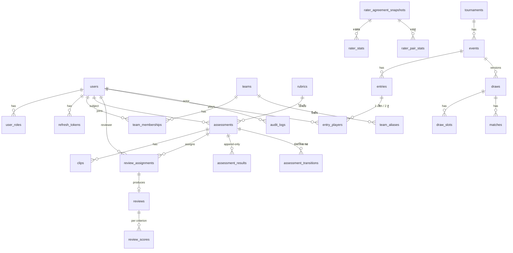

# ร่างโครงข้อมูล (Prisma) ของ blulens — bl-07 prep

> สถานะ: **ร่าง — ยังไม่สร้าง model/migration จริง** · เริ่มเขียน `schema.prisma` + migration ได้เมื่อ god แจ้งว่าเจ้าของอนุมัติ bl-02 + bl-03 แล้ว
> ผู้เขียน: Kevin (Senior BE) · 2026-10-07
> อ้างอิง: [`../specs/architecture.md`](../specs/architecture.md) §3–5 · [`../specs/grading.md`](../specs/grading.md) §2–8 + ภาคผนวก ข · [`../api/openapi.yaml`](../api/openapi.yaml) · [`../qa/test-plan.md`](../qa/test-plan.md) (INV-1..4, DR-*, RG-*) · [`../specs/draw.md`](../specs/draw.md) (bl-04)

## 1. สรุปใน 1 นาที

- 25 ตาราง แบ่ง 6 กลุ่ม: ตัวตน/สิทธิ์ · ทีม · การประเมินมือ · สถิติกรรมการ · รายการแข่ง/การสมัคร · การจับสาย + audit
- **ผลประเมินเก็บรูปแบบ bad8bit ครบ**: `score` (ทศนิยม) + `margin` + `lower` / `upper` / `center` (grade key) + `kind` + `label` — เก็บเป็น snapshot ในแถว ไม่ฉายใหม่ตอนอ่าน (ตาม G9 ที่ Jim เสนอ)
- **ตารางผลเป็น append-only** — คำนวณใหม่/override = แถวใหม่ ไม่มี UPDATE/DELETE
- **เกรดทางการ** ของผู้เล่น = ผลล่าสุดที่สถานะ `approved` หรือ `overridden` → draw และเกณฑ์สมัครแข่งใช้ `center` ของแถวนั้น
- **ทีม**: เก็บชื่อแบบ normalize แล้วเป็น unique ใน DB + ตาราง alias (ไทย/อังกฤษ) — กันกฎ "ทีมเดียวกันห้ามเจอกันรอบแรก" รั่วเพราะสะกดต่างกัน
- Guest **ไม่ใช่ role ที่เก็บใน DB** — คือผู้ที่ไม่ได้ล็อกอิน
- มีเรื่องที่เจ้าของต้องตัดสิน 9 ข้อ (§7) — ส่วนใหญ่เป็นเรื่องเดียวกับ Jim / Dwight ถามอยู่แล้ว ระบุไว้ว่าซ้อนกับข้อไหน

## 2. ERD



## 3. ตารางทีละกลุ่ม

กติการ่วมทุกตาราง: PK = `uuid` (`@default(uuid())` — ตรง `format: uuid` ใน openapi) · เวลาเป็น `timestamptz` UTC · ชื่อ model เป็น PascalCase, ชื่อตาราง/คอลัมน์ snake_case ผ่าน `@@map`/`@map` · ไม่มี `tenant_id` (decision A1 = องค์กรเดียว)

### 3.1 ตัวตนและสิทธิ์

| ตาราง | คอลัมน์สำคัญ | หมายเหตุ |
|---|---|---|
| `users` | `email` (unique, citext), `password_hash`, `display_name`, `profile_public` (bool), `status` (`active`/`disabled`), `deleted_at` | ลบ = anonymize ไม่ใช่ลบแถว (ผล/คะแนนอ้างถึงอยู่) — decision S8 |
| `user_roles` | PK (`user_id`, `role`) | `role` = enum `Admin` / `Committee` / `Reviewer` / `Member` · หลาย role ต่อคนได้ (architecture §3) · **Guest ไม่ถูกเก็บ** |
| `refresh_tokens` | `user_id`, `token_hash` (unique), `family_id`, `expires_at`, `revoked_at` | ลอกแบบ refresh rotation ของ kpaccv2 |

- สิทธิ์เป็น string `resource.action` ทะเบียนกลางใน `packages/shared` และ map role → permissions **ในโค้ด** (role ตายตัว 5 ตัว — A2) จึงไม่มีตาราง `permissions` / `role_permissions`

### 3.2 ทีม

| ตาราง | คอลัมน์สำคัญ | หมายเหตุ |
|---|---|---|
| `teams` | `name` (ชื่อแสดงผล), `name_key` (**unique**), `short_name`, `status` | `name_key` = `normalizeTeamName(name)` จาก `packages/shared` — unique ระดับ DB กัน race (RG-07) |
| `team_aliases` | `team_id`, `alias`, `alias_key` (**unique ข้ามทั้งตาราง alias + teams**) | Admin ผูก "บลูวิง" ↔ "Blue Wing" (RG-03) · ตอนสร้างทีมใหม่ ตรวจ `name_key` ชนกับ alias ด้วย |
| `team_memberships` | `user_id`, `team_id`, `valid_from`, `valid_to` (null = ปัจจุบัน) | ใช้ตัดสิน "ทีมเดียวกัน ณ วันที่ X" (conflict of interest, draw) · กฎ: ช่วงวันของคนเดียวกันห้ามทับกัน → **exclusion constraint** (`btree_gist`) ใน migration SQL |

`normalizeTeamName` (ร่าง — รอคำตอบ Dwight Q4): NFC → แปลงเลขไทยเป็นอารบิก → ตัด zero-width/NBSP → trim + ยุบช่องว่าง → lower-case · เรื่องลบเครื่องหมาย/ช่องว่างทั้งหมด (`BlueWing`) รอเจ้าของ (decision S3)

### 3.3 การประเมินมือ

| ตาราง | คอลัมน์สำคัญ | หมายเหตุ |
|---|---|---|
| `rubrics` | `method_version` (unique เช่น `grading-v1`), `criteria` (jsonb: key, nameTh, weight, anchorsTh), `params` (jsonb: N_min, เกณฑ์โดด, margin), `active` (bool), `created_by` | **เวอร์ชันละแถว แก้ไม่ได้** — ปรับ rubric = แถวใหม่ (G1) · active ได้ทีละ 1 แถว (partial unique index) — decision S5 |
| `assessments` | `subject_user_id`, `rubric_id`, `status` (enum 10 ค่าตาม openapi), `reviews_required` (default 3), `submitted_at`, `version` (optimistic lock) | `rubric_id` ล็อกตอน submit — ทุกรีวิวในคำขอเดียวใช้ rubric เดียวกัน |
| `assessment_transitions` | `assessment_id`, `from_status`, `to_status`, `actor_id` (null = ระบบ), `reason`, `created_at` | ประวัติ state machine (grading §8) แบบ append-only · ตรวจทางเปลี่ยนสถานะด้วยฟังก์ชัน pure ใน shared ก่อนเขียน |
| `clips` | `assessment_id`, `object_key` (unique), `status` (`pending_upload`/`uploaded`/`rejected`), `content_type`, `size_bytes`, `sha256`, `duration_sec`, `upload_expires_at`, `purge_after` | object key = `clips/<assessmentId>/<clipId>` — ไม่ชนข้ามผู้ใช้ (RG-11) · แถว `pending_upload` ที่เลย `upload_expires_at` ถูก job ลบ (RG-09) · unique (`assessment_id`, `sha256`) กันอัปซ้ำ |
| `review_assignments` | `assessment_id`, `reviewer_id`, `state` (`open`/`submitted`/`expired`/`declined`), `due_at`, `decline_reason`, `assigned_by` (null = สุ่มอัตโนมัติ) | **partial unique** (`assessment_id`, `reviewer_id`) where state in (`open`,`submitted`) — กันมอบหมายคนเดิมซ้ำ · conflict of interest ตรวจที่ service (ต้องดู team_memberships ณ วันมอบหมาย) |
| `reviews` | `assignment_id` (**unique** = 1 รีวิวต่อ assignment), `comment`, `overall` (v_j ที่คำนวณตอนส่ง), `abstained` (bool), `submitted_at` | ส่งแล้วแก้ไม่ได้ (blind + immutable) |
| `review_scores` | PK (`review_id`, `criterion`), `grade_index` (smallint 0–14, **null = ประเมินไม่ได้**) | เก็บดัชนี ไม่เก็บ string — `CHECK (grade_index between 0 and 14)` |
| `assessment_results` | ดูตารางด้านล่าง | append-only |

**`assessment_results` — หัวใจของรูปแบบผล (TEAM.md §6 / grading §6)**

| คอลัมน์ | ชนิด | ความหมาย |
|---|---|---|
| `assessment_id`, `version` | uuid, int | unique (`assessment_id`, `version`) · version เริ่ม 1 |
| `source` | enum `computed` / `override` | |
| `status` | enum `needs_reviewers` / `pending_approval` / `disputed` / `approved` / `overridden` | สถานะของผลแถวนี้ — อนุมัติ = แถวใหม่ที่คัดลอกตัวเลขเดิม + status `approved` (ไม่ UPDATE) |
| `score` | `Decimal(6,4)` | ทศนิยมหน่วยขั้น 0–14.9999 · **null เฉพาะ `needs_reviewers`** (ดู decision S6) |
| `margin` | `Decimal(6,4)` | 0.25–3.0 (override = 0) |
| `lower_index`, `upper_index`, `center_index` | smallint 0–14 | snapshot (G9) · `CHECK (lower_index <= center_index AND center_index <= upper_index)` = INV-2 ที่ระดับ DB |
| `kind` | enum `exact` / `straddle` / `wide` | |
| `label` | text | `S` · `S/S+` · `S-–N-` |
| `n_raters`, `n_excluded`, `spread` | int, int, Decimal | |
| `flags` | text[] | `OUTLIER_EXCLUDED` / `HIGH_DISAGREEMENT` / `LOW_RATER_COUNT` / `OVERRIDE` |
| `method_version` | text | เช่น `grading-v1` |
| `inputs` | jsonb | คะแนนดิบ v_j, ใครถูกตัด, z-score, พารามิเตอร์ทั้งหมด ณ ตอนนั้น |
| `reason` | text | บังคับเมื่อ override (≥ 20 ตัวอักษร) หรืออนุมัติผล disputed |
| `computed_at`, `computed_by` | timestamptz, uuid null | null = ระบบคำนวณ |

- API ส่ง `lower`/`upper`/`center` เป็น grade key โดยแปลงจากดัชนีด้วย `GRADES[i]` ใน shared — DB เก็บดัชนีเพื่อให้เทียบลำดับ/CHECK ได้
- **เกรดทางการ** = แถวล่าสุดของผู้เล่นที่ `status in (approved, overridden)` — index (`assessment_id`, `version desc`) + query ผ่าน `subject_user_id` · ถ้าช้าค่อยเพิ่ม view/คอลัมน์ cache ภายหลัง (ไม่ใช่เรื่องของเจ้าของ)

### 3.4 สถิติกรรมการ (Kappa)

| ตาราง | คอลัมน์สำคัญ | หมายเหตุ |
|---|---|---|
| `rater_agreement_snapshots` | `window` (เช่น `90d`), `window_start`, `window_end`, `method_version`, `fleiss_kappa_tier`, `fleiss_n`, `computed_at`, `trigger` (`nightly`/`manual`) | 1 แถวต่อรอบคำนวณ (grading §5) |
| `rater_stats` | `snapshot_id`, `reviewer_id`, `reviews`, `bias`, `kappa_vs_consensus`, `kappa_n`, `outlier_rate`, `flagged` | kappa null = ข้อมูลไม่พอ/ไม่นิยาม (GR-08) |
| `rater_pair_stats` | `snapshot_id`, `reviewer_a`, `reviewer_b` (a < b), `cohen_kappa_quadratic`, `n_shared` | |

### 3.5 รายการแข่งและการสมัคร ("registrations")

| ตาราง | คอลัมน์สำคัญ | หมายเหตุ |
|---|---|---|
| `tournaments` | `name`, `venue`, `starts_on` (date), `entries_close_at`, `status` (`draft`/`open`/`closed`/`running`/`finished`), `created_by` | |
| `events` | `tournament_id`, `discipline` (`MS`/`WS`/`MD`/`WD`/`XD`), `grade_min_index`, `grade_max_index`, `max_entries` (≤ 256) | unique (`tournament_id`, `discipline`, `grade_min_index`, `grade_max_index`) |
| `entries` | `event_id`, `status` (`active`/`reserve`/`withdrawn`), `reserve_rank`, `withdrawn_at`, `created_by` | = "registration" ใน TEAM.md · ตัวสำรองลงช่องเดิมเมื่อมีคนถอนหลังเผยแพร่ (draw.md) |
| `entry_players` | PK (`entry_id`, `user_id`), `event_id` (คัดลอกมา), `grade_result_id` (ผลที่อนุมัติซึ่งใช้ผ่านเกณฑ์ตอนสมัคร) | unique (`event_id`, `user_id`) = 1 คน 1 entry ต่อ event · ไม่มีเกรดอนุมัติ → สมัครไม่ได้ (`NO_APPROVED_GRADE`) |

- **ทีมและ `seedScore` ไม่เก็บใน entry** — draw.md §2 ให้อ่านทีม ณ **วันสุ่ม** และคำนวณ seedScore ตอนสุ่ม แล้วเก็บเป็น snapshot ในแถว `draws` (ตรวจซ้ำได้ด้วย `input_hash` + ปุ่ม verify)
- ประเภทคู่: ทีมของ entry = ชุดทีมของทั้งสองคน · ชนเมื่อมีทีมซ้ำอย่างน้อย 1 ทีม (draw.md D7)

### 3.6 การจับสายและ audit (ตาม draw.md)

| ตาราง | คอลัมน์สำคัญ | หมายเหตุ |
|---|---|---|
| `draws` | `event_id`, `version`, `status` (`preview`/`published`/`superseded`/`locked`), `seed` (text), `seed_source` (`server`/`committee`), `input_hash`, `snapshot` (jsonb: entry id, ชุดทีม, seedScore ณ วันสุ่ม), `ruleset_version` (`draw-v1`), `size` (2^k), `seeds_count`, `same_team_r1_count`, `minimum_possible_conflicts`, `conflicts` (jsonb), `conflicts_acknowledged_by`/`_at` (ต้องมีก่อน publish ถ้า conflicts > 0), `search_stats` (jsonb), `reason` (redraw), `created_by` | unique (`event_id`, `version`) · **partial unique (`event_id`) where status = `published`** = มีสายเผยแพร่ได้ทีละ 1 (DR-14 กันกดพร้อมกันที่ DB) · `locked` เมื่อมีผลแมตช์แรก → redraw ถูกปฏิเสธ (DR-09) |
| `draw_slots` | PK (`draw_id`, `position`), `entry_id` (null = bye), `seed_no` | unique (`draw_id`, `entry_id`) — ทุกคนถูกจัดครั้งเดียว (DR-01) |
| `matches` | `draw_id`, `round`, `match_no`, `top_entry_id`, `bottom_entry_id`, `winner_entry_id`, `status` (`scheduled`/`bye`/`walkover`/`finished`), `score_text` | unique (`draw_id`, `match_no`) |
| `audit_logs` | `actor_id` (null = ระบบ), `action` (`assessment.override` ฯลฯ), `entity_type`, `entity_id`, `before`, `after` (jsonb), `reason`, `ip`, `created_at` | append-only: role ของแอป **ไม่มีสิทธิ์ UPDATE/DELETE** บนตารางนี้ (REVOKE ใน migration) — เช่นเดียวกับ `assessment_results`, `assessment_transitions` |

## 4. ร่าง Prisma (ย่อ — โครงจริงเขียนใน bl-07 หลังอนุมัติ)

```prisma
enum Role { Admin Committee Reviewer Member }
enum AssessmentStatus { draft submitted in_review needs_reviewers disputed pending_approval approved overridden rejected withdrawn }
enum ResultStatus { needs_reviewers pending_approval disputed approved overridden }
enum ResultSource { computed override }
enum GradeKind { exact straddle wide }
enum AssignmentState { open submitted expired declined }
enum ClipStatus { pending_upload uploaded rejected }

model User {
  id            String     @id @default(uuid()) @db.Uuid
  email         String     @unique @db.Citext
  passwordHash  String     @map("password_hash")
  displayName   String     @map("display_name") @db.VarChar(80)
  profilePublic Boolean    @default(false) @map("profile_public")
  deletedAt     DateTime?  @map("deleted_at") @db.Timestamptz
  createdAt     DateTime   @default(now()) @map("created_at") @db.Timestamptz
  roles         UserRole[]
  @@map("users")
}

model UserRole {
  userId String @map("user_id") @db.Uuid
  role   Role
  user   User   @relation(fields: [userId], references: [id])
  @@id([userId, role])
  @@map("user_roles")
}

model AssessmentResult {
  id            String           @id @default(uuid()) @db.Uuid
  assessmentId  String           @map("assessment_id") @db.Uuid
  version       Int
  source        ResultSource
  status        ResultStatus
  score         Decimal?         @db.Decimal(6, 4)
  margin        Decimal?         @db.Decimal(6, 4)
  lowerIndex    Int?             @map("lower_index") @db.SmallInt
  upperIndex    Int?             @map("upper_index") @db.SmallInt
  centerIndex   Int?             @map("center_index") @db.SmallInt
  kind          GradeKind?
  label         String?
  nRaters       Int              @map("n_raters")
  nExcluded     Int              @map("n_excluded")
  spread        Decimal?         @db.Decimal(6, 4)
  flags         String[]
  methodVersion String           @map("method_version")
  inputs        Json
  reason        String?
  computedAt    DateTime         @default(now()) @map("computed_at") @db.Timestamptz
  computedBy    String?          @map("computed_by") @db.Uuid
  @@unique([assessmentId, version])
  @@map("assessment_results")
}
// ...ตารางอื่นตาม §3 · CHECK / partial unique / exclusion constraint / REVOKE เขียนเป็น SQL ใน migration
// (Prisma schema แสดงสิ่งเหล่านี้ไม่ได้) และมี e2e test ยืนยันแต่ละ constraint
```

## 5. ข้อกำหนดจากสเปก → บังคับที่ไหน

| กฎ | แหล่ง | บังคับที่ |
|---|---|---|
| ผลมี score/lower/upper ครบ, lower ≤ center ≤ upper | INV-1/2, grading §6 | ฟังก์ชัน shared (unit test) + `CHECK` ใน DB + zod contract test |
| ผลแก้ย้อนหลังไม่ได้ | architecture §5, grading §6 | append-only + REVOKE UPDATE/DELETE |
| 1 รีวิวต่อ assignment, ส่งแล้วแก้ไม่ได้ | grading §7 | unique `reviews.assignment_id` + ไม่มี endpoint แก้ |
| ห้ามมอบหมายคนเดิมซ้ำ | grading §7 | partial unique บน `review_assignments` |
| ห้ามประเมินตัวเอง/ทีมเดียวกัน | architecture §3 | service + query `team_memberships` ณ วันมอบหมาย (DB ทำ CHECK ข้ามตารางไม่ได้) |
| ชื่อทีมสะกดต่าง = ทีมเดียว | RG-01..07 | `name_key` unique + `team_aliases` |
| สายเผยแพร่ได้ทีละ 1, กดพร้อมกันได้ 409 | DR-14 | partial unique บน `draws` |
| ทุก entry อยู่ในสายครั้งเดียว | DR-01 | unique (`draw_id`, `entry_id`) |
| ทุกการกระทำสำคัญมีร่องรอย | architecture §5 | `audit_logs` เขียนใน transaction เดียวกับการกระทำ |

## 6. ประเด็นสัญญา API ที่ต้องให้ Jim แก้ (ไม่ต้องถามเจ้าของ)

1. `GradeView.description` ใน openapi เขียน `upper = floor(score + margin)` แต่ grading.md ข.4 ใช้ `ceil(score + m) − 1` (ช่วงครึ่งเปิด) → ควรแก้ openapi ให้ตรง grading.md
2. `AssessmentResult` ใน openapi ไม่มีฟิลด์ `status` ของแถวผล → เสนอเพิ่ม (DB เก็บแล้ว)
3. `ReasonInput.minLength: 5` แต่ override ต้อง ≥ 20 ตัวอักษร (grading §8) → แยก schema `OverrideInput`
4. `Clip.status` ใน openapi (`pending_upload`/`uploaded`/`rejected`) ต่างจากที่ Dwight ใช้ใน RG-08/09 (`uploading`/`ready`) → ยึด openapi แล้วแจ้ง Dwight
5. INV-1 (Dwight) ต้องการ score/lower/upper ไม่เป็น null **ทุกสถานะ** แต่ grading.md ไม่สรุปผลเมื่อ `needs_reviewers` → ดู decision S6

## 7. เรื่องที่เจ้าของต้องตัดสิน (schema)

| # | เรื่อง | ตัวเลือก | ข้อเสนอของ Kevin | ถ้าเลือกอย่างอื่น | ซ้อนกับ |
|---|---|---|---|---|---|
| S1 | ผู้ใช้ 1 คนถือหลาย role | (ก) ได้ (ข) ได้ 1 role | **(ก)** ตาม architecture §3 | (ข) กรรมการที่เป็นนักกีฬาด้วยต้องมี 2 บัญชี | A2 |
| S2 | Guest | (ก) = ผู้ไม่ล็อกอิน ไม่เก็บใน DB (ข) บัญชีชนิด Guest | **(ก)** | (ข) ต้องมีสมัคร/ล็อกอินแบบ Guest และหน้าจัดการเพิ่ม | — |
| S3 | ชื่อทีม | (ก) เลือกจากรายการ + Admin สร้างทีม/ผูก alias (ข) พิมพ์อิสระ ระบบ normalize + Admin ผูก alias ภายหลัง | **(ก)** กันทีมซ้ำตั้งแต่ต้น | (ข) สะดวกผู้สมัครแต่ Admin ต้องตามรวมทีมซ้ำก่อนจับสายทุกครั้ง | Dwight Q4 |
| S4 | ผู้เล่นสังกัดได้กี่ทีมพร้อมกัน | (ก) 1 ทีม ณ เวลาหนึ่ง (มีประวัติย้ายทีม) (ข) หลายทีม | **(ก)** | (ข) กฎ "ทีมเดียวกัน" ต้องนิยามใหม่ (ทีมใดทีมหนึ่งตรงกัน?) และ conflict of interest กว้างขึ้น | — |
| S5 | ใครแก้ rubric ได้ | (ก) Committee แก้ผ่านหน้าเว็บ (หน้า S12 ของ Pam) → ได้ rubric เวอร์ชันใหม่ (ข) แก้ได้เฉพาะผ่านทีม dev | **(ก)** แต่ใช้กับคำขอที่ส่งหลังจากนั้นเท่านั้น | (ข) ไม่ต้องมีตาราง/หน้า rubric แต่ทุกการปรับต้องรอ deploy | G1 |
| S6 | ผลตอน "ยังสรุปไม่ได้" (needs_reviewers / ยังไม่มีรีวิว) | (ก) ไม่มีแถวผลเชิงตัวเลข — API ส่ง `grade: null` + สถานะ (ข) ส่งค่าตั้งต้นที่นิยามไว้ เช่น ช่วงเต็ม RK1–P+ kind `wide` | **(ก)** ไม่สร้างตัวเลขที่ไม่มีจริง | (ข) ตรง INV-1 ของ Dwight ตรงตัว แต่ค่าปลอมอาจถูกนำไปใช้ผิด | Dwight INV-1 / GR-05 |
| S7 | เกรดมีอายุ | (ก) ไม่มีอายุ (ข) หมดอายุหลัง N เดือน ต้องประเมินใหม่ก่อนสมัครแข่ง | **(ก)** ช่วงแรก แต่เผื่อคอลัมน์ `expires_at` ไว้ (null) | (ข) ต้องกำหนด N และหน้าแจ้งเตือนผู้เล่น | grading §10 ข้อ 2 |
| S8 | ลบบัญชี / เก็บคลิปนานเท่าไร (PDPA) | (ก) ลบบัญชี = ปิด+ลบข้อมูลส่วนตัว เก็บคะแนนแบบไม่ระบุตัว · ลบไฟล์คลิป N วันหลังผลอนุมัติ (ข) เก็บทุกอย่างถาวร | **(ก)** N = 180 วัน (เสนอ) | (ข) ดิสก์โตเรื่อย ๆ และเสี่ยง PDPA | architecture §9 ข้อ 3 |
| S9 | ประเภทคู่ที่ 2 คนต่างทีม — กฎรอบแรก | (ก) ชนถ้ามีทีมซ้ำอย่างน้อย 1 ทีม (ข) ชนเฉพาะเมื่อทั้งคู่มาจากทีมเดียวกันหมด | **(ก)** — ตรงกับ Jim | schema ไม่เปลี่ยน (เปลี่ยนแค่ตัวจับสาย) | **= draw.md D7** (ตอบที่ D7 ที่เดียว) |

> **สิ่งที่เจ้าของต้องตอบ:** S1–S9 · S1, S3, S5, S6, S7, S8, S9 ซ้อนกับคำถามของ Jim/Dwight — god รวมเป็นชุดเดียวได้
