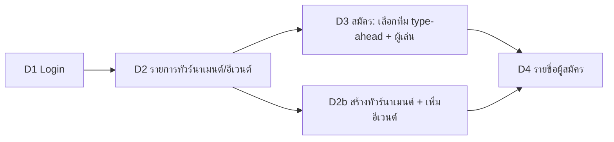

# Demo slice 1 (bl-21): login → สร้างอีเวนต์ → สมัครพร้อม type-ahead ทีม → รายชื่อผู้สมัคร

> Pam · 2026-10-07 · **สเปกพร้อมสร้างทันที ไม่รอ Stitch** (ภาพสวยตามมาทีหลัง) · ใช้โทเคน daylight ของ bad8bit (T5) · ชื่อฟิลด์/endpoint ตาม `docs/api/openapi.yaml` บน develop
> สถานะ: [WAITING FOR OWNER APPROVAL] เฉพาะ 4 หน้าจอนี้ (อนุมัติบางส่วน) · ยึด `contract-alignment.md` + `v3-umpire-grading-v2.md` เมื่อขัดกัน

## 0. ข้อขัดข้องที่ต้องตัดสินก่อนสร้าง (ให้ god/Jim ตอบ — ไม่ขวางหน้า login/รายการ)

| # | ประเด็น | ทางที่ผมสมมติในสเปกนี้ |
|---|---|---|
| X1 | contract: สร้าง tournament/event = **Committee** เท่านั้น แต่ demo ต้อง "login ด้วย admin ที่ seed ไว้ → สร้างอีเวนต์" | seed ผู้ใช้ demo ให้มีบทบาท **Admin + Committee** (A9 หลายบทบาท = union) เมนู/ปุ่มสร้างโผล่ตามสิทธิ์จริงจาก `Me.permissions` |
| X2 | `POST /events/{id}/entries` คืน 409 `NO_APPROVED_GRADE` ถ้าผู้เล่นไม่มีเกรดอนุมัติ | seed ผู้เล่นตัวอย่างให้มีเกรดอยู่ในช่วงอีเวนต์; ฟอร์มแสดง error 409 เป็นข้อความอ่านง่ายพร้อม CTA "ขอประเมินเกรด" (ยังไม่สร้างหน้าในสไลซ์) |
| X3 | "Committee เห็นการสมัคร" | ใช้ `GET /events/{id}/entries` (หน้ารายชื่อ S04 แท็บผู้สมัคร) |

## 1. ผังเส้นทาง



AppShell (ทุกหน้ายกเว้น D1): top bar = โลโก้ "blulens" + ชื่อผู้ใช้ + บทบาท + ออกจากระบบ; mobile มี bottom tab 2–3 ช่อง (อีเวนต์ / ฉัน). ธีม daylight, เมนูซ่อน/โชว์ตาม `Me.permissions`.

---

## D1 เข้าสู่ระบบ (= S02 ส่วน login) — `/login`

- API: `POST /auth/login {identifier, password}` → `Me` (cookie) · หลังสำเร็จไป `returnTo` หรือ `/events`
- ฟิลด์: ตัวระบุ (`identifier` อีเมลหรือชื่อผู้ใช้), รหัสผ่าน; ลิงก์ "สมัครสมาชิก" (`/register` → `POST /auth/register {email,password≥10,displayName}`)

```
┌──────────────────────────┐
│        blulens           │
│ เข้าสู่ระบบ               │
│ อีเมลหรือชื่อผู้ใช้       │
│ [______________________] │
│ รหัสผ่าน                 │
│ [______________________] │
│ [      เข้าสู่ระบบ      ]│
│ ยังไม่มีบัญชี? สมัครสมาชิก│
└──────────────────────────┘
```

| State | แสดง |
|---|---|
| ปกติ | ปุ่มหลักเปิด เมื่อกรอกครบ |
| submitting | ปุ่ม disabled + spinner |
| 401 | แบนเนอร์เดียว "อีเมล/ชื่อผู้ใช้หรือรหัสผ่านไม่ถูกต้อง" (ไม่บอกว่าผิดช่องไหน) |
| เครือข่าย/5xx | "เชื่อมต่อไม่ได้ ลองใหม่" + ปุ่มลองใหม่ (ค่าที่กรอกคงอยู่) |
| ล็อกอินแล้ว | redirect `/events` |

Components: AppShell(bare), TextField, Button, ErrorBanner · ทดสอบรับ: Enter ส่งฟอร์ม, ลำดับ Tab, error อ่านด้วย screen reader (role=alert)

---

## D2 รายการทัวร์นาเมนต์/อีเวนต์ + สร้าง — `/events`, `/events/new`

- API: `GET /tournaments` (cursor/limit) · สร้าง `POST /tournaments {name, venue?, startsOn(date), entriesCloseAt(date-time)}` · เพิ่มอีเวนต์ `POST /tournaments/{id}/events {discipline MS|WS|MD|WD|XD, gradeMin, gradeMax, maxEntries?, requiresFreshAssessment?, minReviewers?}`
- บทบาท: ทุกคนที่ล็อกอินดูรายการ; ปุ่ม "สร้างทัวร์นาเมนต์" เห็นเฉพาะผู้มีสิทธิ์สร้าง (Committee) — Admin ล้วนเห็นรายการแต่ไม่เห็นปุ่ม

```
┌────────────────────────────────────┐
│ blulens        สมชาย ▾ [ออก]        │
├────────────────────────────────────┤
│ ทัวร์นาเมนต์            [+ สร้าง]    │
│ ┌────────────────────────────────┐ │
│ │ เชียงใหม่ โอเพ่น   [เปิดรับ]     │ │
│ │ 12 พ.ย. · สนาม X · ปิดรับ 1 พ.ย. │ │
│ │ อีเวนต์: MS S-–S+ · WD …         │ │
│ │ [ดูผู้สมัคร] [สมัคร]            │ │
│ └────────────────────────────────┘ │
└────────────────────────────────────┘
```

สร้างทัวร์นาเมนต์ (หน้าเดียว ไม่ใช่ wizard 5 ขั้นในสไลซ์ — wizard เต็มตาม S03 ทำภายหลัง):

| ฟิลด์ | กติกา |
|---|---|
| ชื่อ* | ≤ 80 ตัว |
| สถานที่ | ไม่บังคับ |
| วันแข่ง* (`startsOn`) | ต้องไม่ย้อนหลัง |
| ปิดรับสมัคร* (`entriesCloseAt`) | ก่อนหรือเท่าวันแข่ง |
| อีเวนต์ (เพิ่มได้หลายแถว) | ประเภท (MS/WS/MD/WD/XD แสดงชื่อไทยกำกับ), ช่วงเกรด `gradeMin`–`gradeMax` (เลือกจาก RK1..P+ จัดกลุ่ม 5 tier; min ≤ max), จำนวนสูงสุด (ไม่บังคับ ≤ 256), toggle "ต้องประเมินใหม่สำหรับอีเวนต์นี้" (A13) |

```
 ชื่อ*        [__________________]
 สถานที่      [__________________]
 วันแข่ง*     [__/__/____]   ปิดรับ* [__/__/____ __:__]
 อีเวนต์
 ┌ ประเภท [MS ชายเดี่ยว▼]  เกรด [S- ▼] ถึง [S+ ▼]  สูงสุด [__] ┐ ✕
 [+ เพิ่มอีเวนต์]
 [ยกเลิก]  [สร้างทัวร์นาเมนต์]
```

| State | แสดง |
|---|---|
| โหลดรายการ | skeleton 3 การ์ด |
| ว่าง | "ยังไม่มีทัวร์นาเมนต์" + (ผู้มีสิทธิ์) ปุ่ม "สร้างทัวร์นาเมนต์แรก" |
| error รายการ | ErrorBanner + ลองใหม่ |
| validation | error ใต้ช่อง + สรุปบนฟอร์ม, โฟกัสช่องแรกที่ผิด |
| สร้างสำเร็จ | toast "สร้างแล้ว" → กลับ `/events` การ์ดใหม่ถูกไฮไลต์ |
| 403 | ซ่อนปุ่ม; เข้า URL ตรง → หน้า "ไม่มีสิทธิ์" |
| สถานะทัวร์นาเมนต์ | ป้ายตาม `draft/open/closed/running/finished` (ข้อความ+ไอคอน); "สมัคร" ใช้ได้เฉพาะ `open` และก่อน `entriesCloseAt` (ปุ่มปิดพร้อมเหตุผล) |
| หมายเหตุ | ถ้า API ไม่มี endpoint เปลี่ยนสถานะ draft→open ให้ถามใน Open Q ของ Jim: demo ต้องการทัวร์นาเมนต์ที่ `open` ได้ทันทีหลังสร้าง |

Components: AppShell, EventCard(เป็น TournamentCard), StatusBadge, EmptyState, ErrorBanner, TextField, DateField/DateTimeField, GradeRangeSelect (ใหม่: 2 select เรียงตามบันได + จัดกลุ่ม tier), Select, Toggle, Button, Toast

---

## D3 สมัครอีเวนต์ + ทีม type-ahead — `/events/:eventId/register`

- API: `GET /events/{eventId}/entries` (ตรวจซ้ำ) · เลือกทีม `GET /teams/suggest?q=&limit=8` · เข้าทีม `POST /me/teams {teamId}` → `{teams, teamCount, warnings[MULTI_TEAM]}` · ขอทีมใหม่ `POST /team-requests {name}` · สมัคร `POST /events/{eventId}/entries {playerIds[1..2]}` → `Entry` (409: `ENTRY_GRADE_OUT_OF_BAND | ENTRIES_CLOSED | NO_APPROVED_GRADE | FRESH_ASSESSMENT_REQUIRED`)
- บทบาท: Member (สมัครตนเอง), Committee (สมัครแทนผู้เล่น — เลือกผู้เล่นจากรายชื่อ; ดูข้อสมมติ X1)
- รูปแบบเดี่ยว = ผู้เล่น 1 คน; คู่ (MD/WD/XD) = ผู้เล่น 2 คน (คนที่ 2 เลือกจากผู้ใช้ที่ค้นหา — TBD-API: endpoint ค้นหาผู้ใช้ ถ้ายังไม่มีให้สไลซ์รองรับแค่เดี่ยวก่อน)

```
┌──────────────────────────────┐
│ ← สมัคร: เชียงใหม่ โอเพ่น      │
│ อีเวนต์: MS ชายเดี่ยว S-–S+    │
│ ปิดรับ 1 พ.ย.                  │
├──────────────────────────────┤
│ ผู้เล่น   สมชาย (คุณ)          │
│ เกรดของคุณ [S] ช่วง S-–S+  ✓ในช่วง│
│                               │
│ ทีม/สโมสร                      │
│ [เชียง____________      ▾]    │
│  ┌─────────────────────────┐ │
│  │ เชียงใหม่ แบด             │ │
│  │ เชียงราย คลับ             │ │
│  │ ไม่พบทีม? ขอเพิ่มทีมใหม่   │ │
│  └─────────────────────────┘ │
│ ทีมของคุณ: [เชียงใหม่ แบด ✕]   │
│ ⚠ คุณสังกัด 2 ทีมแล้ว         │
│ [        สมัคร        ]       │
└──────────────────────────────┘
```

พฤติกรรม TeamCombobox (A8/A11):
- พิมพ์ ≥ 1 ตัว → เรียก suggest แบบ debounce 250 ms (ยกเลิกคำขอเก่า); แสดงชื่อทีม + ถ้าตรงกับ alias แสดง "(ชื่อเรียกอื่น: …)"
- **ต้องเลือกจากรายการ** ข้อความที่พิมพ์เฉยๆ ไม่ถือว่าเลือก (แสดง error "กรุณาเลือกทีมจากรายการ")
- keyboard: ↑/↓ เลื่อน, Enter เลือก, Esc ปิด; รองรับ role=combobox/listbox
- ไม่พบ → แถวสุดท้าย "ขอเพิ่มทีมใหม่" → dialog ยืนยันชื่อ → `POST /team-requests` → ข้อความ "ส่งคำขอแล้ว รอ Committee" (ยังสมัครต่อโดยไม่มีทีมนี้ไม่ได้ถ้าทีมเป็นข้อบังคับ — ค่าเริ่มต้น: ทีมไม่บังคับ แต่แนะนำ)
- เลือกทีม → `POST /me/teams` → แสดงชิปทีม; `teamCount > 1` หรือ `warnings` มี `MULTI_TEAM` → แบนเนอร์เตือน "คุณสังกัด N ทีมแล้ว" (เตือน ไม่บล็อก)
- แสดงเกรดของผู้เล่นเองเท่านั้น (จาก `Me.currentGrade`); toggle "แสดงเกรดบนสายสาธารณะ" ค่าเริ่มต้นปิด → `POST /entries/{id}/grade-consent` หลังสมัคร (ในสไลซ์ใส่ได้แต่ไม่จำเป็น)

| State | แสดง |
|---|---|
| ปกติ | ปุ่มสมัครเปิด |
| suggest โหลด | spinner เล็กในช่อง; ไม่พบ = "ไม่พบทีมที่ตรงกัน" |
| suggest error | "ค้นหาทีมไม่สำเร็จ" + ลองใหม่; ยังสมัครได้ถ้าไม่ใส่ทีม |
| 409 ENTRIES_CLOSED | แบนเนอร์ "ปิดรับสมัครแล้ว" (ฟอร์มปิด) |
| 409 ENTRY_GRADE_OUT_OF_BAND | "เกรดของคุณอยู่นอกช่วงของอีเวนต์นี้" + แสดงช่วง |
| 409 NO_APPROVED_GRADE | "คุณยังไม่มีเกรดที่อนุมัติ" + ลิงก์ "ขอประเมินเกรด" (ปลายทางยังไม่มีในสไลซ์: แสดงเป็นข้อความ) |
| 409 FRESH_ASSESSMENT_REQUIRED | "อีเวนต์นี้ต้องประเมินใหม่" (ข้อความเดียวกัน) |
| สมัครซ้ำ (มี entry active) | แสดง "คุณสมัครแล้ว" + ลิงก์ไป D4 |
| สำเร็จ | หน้ายืนยัน + ปุ่ม "ดูรายชื่อผู้สมัคร" (D4) |
| ออฟไลน์ | "ไม่มีการเชื่อมต่อ" ฟอร์มไม่หาย |

Components: AppShell, EventSummaryCard, PlayerGradeCard (แสดง GradeBand แบบ compact: `label`, `lower`–`upper`), **TeamCombobox** (props: `value`, `onSearch(q)`, `onSelect(team)`, `onRequestNew(name)`, `loading`, `error`), TeamChip, WarningBanner (variant multiTeam), Toggle, Button(sticky บนมือถือ), ConfirmDialog, ErrorBanner

---

## D4 รายชื่อผู้สมัคร — `/events/:eventId/entries`

- API: `GET /events/{eventId}/entries` → `Entry[] {id, status active|withdrawn, players[{userId, displayName, teamIds, teamCount, gradeConsent, grade|null}], seedScore|null, gradeVisibility hidden|public|disclosed, warnings[MULTI_TEAM]}`
- บทบาท: ทุกคนที่ล็อกอิน (Guest ดูได้ตาม contract แต่สไลซ์บังคับล็อกอิน); **เกรด/seedScore แสดงเฉพาะเมื่อ API ส่งมา** (ซ่อน = null → แสดง "ซ่อนอยู่" ด้วยไอคอนล็อก+ข้อความ; Committee เห็นเกรดตามสิทธิ์) — UI ห้ามเดา/คำนวณ
- Committee: คอลัมน์/ป้ายเพิ่ม: ⚠ MULTI_TEAM (ไอคอน+ข้อความ "หลายทีม") และปุ่ม "ถอนตัว" (`POST /entries/{id}/withdraw`; ต้องยืนยัน)

```
┌─────────────────────────────────────────────┐
│ ← ผู้สมัคร · MS ชายเดี่ยว S-–S+     12/32      │
│ [ค้นหาชื่อ____]   [ทุกสถานะ ▼]                │
├─────────────────────────────────────────────┤
│ #  ชื่อ            ทีม            เกรด       │
│ 1  สมชาย          เชียงใหม่ แบด   [S] S-–S+  │
│ 2  วิภา           เชียงราย คลับ   🔒 ซ่อนอยู่  │
│ 3  อนันต์ ⚠หลายทีม  A, B          [S+]       │
│ ถอนตัวแล้ว: 1  (ขีดฆ่า + "ถอนตัว")             │
└─────────────────────────────────────────────┘
```
(ใช้ไอคอน lucide แทนอีโมจิจริง)

| State | แสดง |
|---|---|
| โหลด | skeleton แถว |
| ว่าง | "ยังไม่มีผู้สมัคร" + ปุ่ม "สมัคร" (ถ้าสมัครได้) / "คัดลอกลิงก์สมัคร" (Committee) |
| error | ErrorBanner + ลองใหม่ |
| ค้นหาไม่พบ | "ไม่พบผู้สมัครที่ตรงกับ …" |
| ผู้สมัครของฉัน | แถวไฮไลต์ + ป้าย "คุณ" (ข้อความ) |
| ถอนตัว | แถวขีดฆ่า + ข้อความ "ถอนตัว" (กรอง "ทั้งหมด/ใช้งาน/ถอนตัว") |
| mobile | แถวเป็นการ์ด (ชื่อ, ทีม, เกรดบรรทัดล่าง) |
| pagination | เรียงตามเวลาสมัคร; รายการ ≤ 256 โหลดครั้งเดียวแล้วกรองฝั่ง client |

Components: AppShell, DataTable(variant cards บนมือถือ), PlayerTag, TeamChip, GradeBand(compact) / GradeHiddenChip, FlagChip(MULTI_TEAM), StatusBadge, SearchField, Select(filter), ConfirmDialog, EmptyState, ErrorBanner

---

## 2. รายการงานสำหรับ Andy (micro-task ลำดับสร้าง)

1. โทเคน daylight + AppShell + Button/TextField/Select/Toggle/Toast/ErrorBanner/EmptyState/StatusBadge
2. D1 login (+ guard/redirect, `Me` store, เมนูตามสิทธิ์)
3. D2 รายการ + TournamentCard; ฟอร์มสร้าง + GradeRangeSelect + แถวอีเวนต์
4. TeamCombobox (+ TeamChip, WarningBanner) แล้ว D3
5. D4 DataTable/การ์ด + GradeBand compact + GradeHiddenChip + ถอนตัว
6. ต่อ end-to-end ด้วย seed (X1, X2) แล้วตรวจเส้นทางทั้งหมดบน http://localhost:3100

## 3. ตัวแปรการตัดสินใจเจ้าของ (อนุมัติบางส่วน)

1. ยืนยันว่าสไลซ์นี้ใช้ daylight ธรรมดา (ไม่มี pixel) — pixel เฉพาะสายแข่งภายหลัง
2. สไลซ์สร้างทัวร์นาเมนต์แบบหน้าเดียว (ไม่ใช่ wizard 5 ขั้น) ตกลงไหม
3. ทีมไม่บังคับตอนสมัครใช่ไหม (แนะนำ: ไม่บังคับ แต่เตือนเมื่อไม่ใส่ เพราะกฎจับสายใช้ทีม)
4. สไลซ์รองรับเฉพาะ "เดี่ยว" (ผู้เล่น 1 คน) ก่อน คู่ตามมา ตกลงไหม
5. seed ผู้ใช้ demo = Admin+Committee และผู้เล่นตัวอย่างมีเกรด (X1, X2)
