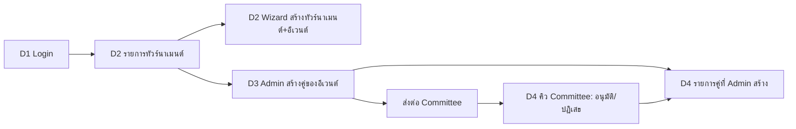

# Demo slice 1 (bl-21 v2): login → สร้างอีเวนต์ (wizard) → Admin สร้างคู่ → Committee ตรวจ/อนุมัติ

> Pam · 2026-10-07 · **v2 หลังเจ้าของตอบ**: (1) คู่ที่ลงแข่งสร้างโดย **Admin** แล้วส่งให้ Committee ประเมิน — ไม่มีการสมัครเองของผู้เล่นในสไลซ์ (2) ธีมอะไรก็ได้ เน้น UX (3) หน้าสร้างอีเวนต์ทำให้ถูกต้องตาม UX (4) **คู่ก่อน** เดี่ยวทีหลัง (5) seed ตามข้อเสนอ
> สเปกพร้อมสร้างทันที ไม่รอ Stitch · ชื่อฟิลด์ตาม `docs/api/openapi.yaml` บน develop; ส่วนที่ contract ยังไม่มีติด **TBD-API** · ยึด `contract-alignment.md` + `v3-umpire-grading-v2.md` เมื่อขัดกัน

## 0. ข้อขัดกับ contract ที่ Jim ต้องตอบ (สไลซ์นี้เปลี่ยนจากข้อกำหนดเดิมของ API)

| # | ประเด็น | ที่สมมติในสเปกนี้ |
|---|---|---|
| X1 | contract: สร้าง tournament/event = **Committee** | seed ผู้ใช้ demo = **Admin + Committee** (A9 union) |
| X2 | contract: `POST /events/{id}/entries` อนุญาต Member, Committee ไม่ใช่ Admin และตรวจเกรดทันที (409 `NO_APPROVED_GRADE` / `ENTRY_GRADE_OUT_OF_BAND`) | owner สั่ง **Admin สร้าง entry** แล้ว "ส่งต่อ Committee ประเมิน" → ต้องมี (ก) สิทธิ์ Admin สร้าง entry (ข) สถานะ entry ก่อนอนุมัติ เช่น `draft → submitted → approved/rejected` + `rejectReason` (ตอนนี้ Entry.status = active/withdrawn) + endpoint submit/approve/reject — **TBD-API** |
| X3 | ไม่มี endpoint ค้นหาผู้ใช้/ผู้เล่นสำหรับ picker | ต้องมี `GET /users/search?q=` คืน `userId, displayName, teamIds, teamCount, currentGrade\|null` — **TBD-API** |
| X4 | ไม่มี endpoint เปลี่ยน tournament draft→open | **TBD-API** (demo ต้องการ open ทันทีหลังสร้าง หรือ toggle "เปิดรับ") |
| X5 | เพิ่มผู้เล่นเข้าสโมสรแทนคนอื่น (`POST /me/teams` เป็นของ Member ตัวเอง) | **TBD-API** สำหรับ Admin ตั้งสโมสรให้ผู้เล่น |
| X6 | "ส่งต่อประเมิน" | ตีความเป็น Committee อนุมัติ entry (ไม่ใช่ขอ assessment คลิป) — ถ้าไม่ใช่ ให้แจ้งกลับ |

## 1. ผังเส้นทาง



AppShell (ยกเว้น D1): top bar = โลโก้ + ชื่อผู้ใช้/บทบาท + ออกจากระบบ; เมนูตาม `Me.permissions`; mobile มี bottom tab (อีเวนต์ / คิว). ธีม daylight (UX เป็นหลัก)

---

## D1 เข้าสู่ระบบ — `/login`

- API: `POST /auth/login {identifier, password}` → `Me` (cookie) · สำเร็จไป `returnTo` หรือ `/events`
- ฟิลด์: ตัวระบุ (`identifier` อีเมลหรือชื่อผู้ใช้), รหัสผ่าน; ลิงก์ "สมัครสมาชิก" (`POST /auth/register {email,password≥10,displayName}`) — ไม่ใช่เส้นทางหลักของ demo

```
┌──────────────────────────┐
│        blulens           │
│ เข้าสู่ระบบ               │
│ อีเมลหรือชื่อผู้ใช้       │
│ [______________________] │
│ รหัสผ่าน                 │
│ [______________________] │
│ [      เข้าสู่ระบบ      ]│
│ ยังไม่มีบัญชี? สมัครสมาชิก│
└──────────────────────────┘
```

| State | แสดง |
|---|---|
| ปกติ | ปุ่มหลักเปิด เมื่อกรอกครบ |
| submitting | ปุ่ม disabled + spinner |
| 401 | แบนเนอร์เดียว "อีเมล/ชื่อผู้ใช้หรือรหัสผ่านไม่ถูกต้อง" |
| เครือข่าย/5xx | "เชื่อมต่อไม่ได้ ลองใหม่" + ปุ่มลองใหม่ (ค่าคงอยู่) |
| ล็อกอินแล้ว | redirect `/events` |

Components: AppShell(bare), TextField, Button, ErrorBanner · ทดสอบรับ: Enter ส่งฟอร์ม, ลำดับ Tab, error role=alert

---

## D2 ทัวร์นาเมนต์ — รายการ + wizard สร้าง — `/events`, `/events/new`

- API: `GET /tournaments` · `POST /tournaments {name, venue?, startsOn, entriesCloseAt}` · `POST /tournaments/{id}/events {discipline, gradeMin, gradeMax, maxEntries?, requiresFreshAssessment?, minReviewers?}` · รูปแบบการแข่ง `PUT /events/{id}/format` (ถ้ารับตอนสร้างไม่ได้ ให้ wizard เรียกหลังสร้างอีเวนต์สำเร็จ) · เปิดรับ = TBD-API (X4)
- สิทธิ์: ทุกคนที่ล็อกอินดูรายการ; wizard เฉพาะผู้มีสิทธิ์สร้าง

### รายการ

```
┌────────────────────────────────────┐
│ ทัวร์นาเมนต์            [+ สร้าง]    │
│ ┌────────────────────────────────┐ │
│ │ เชียงใหม่ โอเพ่น    [เปิดรับ]   │ │
│ │ 12 พ.ย. · สนาม X · ปิดรับ 1 พ.ย. │ │
│ │ อีเวนต์: MD S-–S+ · XD …        │ │
│ │ [เปิด]                          │ │
│ └────────────────────────────────┘ │
└────────────────────────────────────┘
```
States: loading skeleton · ว่าง "ยังไม่มีทัวร์นาเมนต์" + ปุ่มสร้าง · error + ลองใหม่ · ป้ายสถานะ draft/open/closed/running/finished (ข้อความ+ไอคอน)

### Wizard 4 ขั้น

เหตุผล UX: ข้อมูลต่างชนิด (ชื่อ / วันที่ / กติกา) อ่านและตรวจง่ายกว่าเมื่อแบ่งขั้น; ทุกขั้นสั้น ≤ 6 ช่อง; มีหน้าทบทวนก่อนสร้าง; ย้อนกลับได้โดยไม่เสียข้อมูล; ร่างเก็บอัตโนมัติ (ในเครื่อง)

```
 ① พื้นฐาน ─ ② วันที่ ─ ③ ประเภทและกติกา ─ ④ ทบทวน    (stepper; คลิกย้อนขั้นที่ผ่านแล้วได้)
```

| ขั้น | ฟิลด์ | กติกา/ข้อความช่วย |
|---|---|---|
| ① พื้นฐาน | ชื่อ*, สถานที่ | ชื่อ ≤ 80 ตัว มีตัวนับ |
| ② วันที่ | วันแข่ง* (`startsOn`), ปิดรับ* (`entriesCloseAt`) | ปิดรับ ≤ วันแข่ง; ปฏิทิน + พิมพ์ได้; แสดง "เหลืออีก N วัน" |
| ③ ประเภทและกติกา | การ์ดต่อประเภท (เพิ่มได้หลายการ์ด): ประเภท* (**MD/WD/XD แสดงก่อน** ตามสไลซ์คู่ก่อน; MS/WS ตามหลัง), ช่วงเกรด* `gradeMin`–`gradeMax` (GradeRangeSelect), จำนวนสูงสุด, toggle "ต้องประเมินใหม่" (A13), **preset รูปแบบ**: น็อคเอาท์อย่างเดียว / แบ่งกลุ่ม + น็อคเอาท์ (แนะนำเมื่อ ≥ 6 คู่), **preset แมตช์**: รอบกลุ่ม 2×15 ไม่ดิวส์ / รอบน็อคเอาท์ 2 ใน 3 × 21 | ค่าเริ่มต้นตาม tournament-format §2; "ตั้งค่าขั้นสูง" พับไว้ (ขนาดกลุ่ม, ผ่านต่อกลุ่ม, อันดับ 3) |
| ④ ทบทวน | สรุปทุกขั้นอ่านอย่างเดียว + ลิงก์ "แก้" ไปแต่ละขั้น | ปุ่ม "สร้างทัวร์นาเมนต์" (+ toggle "เปิดรับสมัครทันที" ถ้า X4 รองรับ) |

States: invalid → error ใต้ช่อง + สรุปบน + โฟกัสช่องแรกที่ผิด · ออกกลางคัน → dialog ยืนยัน (ร่างเก็บในเครื่อง "ร่างอยู่ในเครื่องนี้") · API error → แบนเนอร์ ค่าคงอยู่ · สำเร็จ → หน้าทัวร์นาเมนต์นั้นพร้อมปุ่ม "+ เพิ่มคู่" (D3) · 403 → ไม่เห็นปุ่ม/หน้า "ไม่มีสิทธิ์"

Components: AppShell, TournamentCard, StatusBadge, Stepper, TextField, DateField/DateTimeField, EventTypeCard (ใหม่), GradeRangeSelect (ใหม่), PresetRadioCards (ใหม่), Toggle, SummaryList (ใหม่), Button, ConfirmDialog, Toast, EmptyState, ErrorBanner

---

## D3 Admin สร้างคู่ของอีเวนต์ แล้วส่งต่อ Committee — `/events/:eventId/entries/new`

- ผู้ใช้: **Admin** (และ Committee) · API: `GET /teams/suggest?q=`, `POST /team-requests`, `POST /events/{id}/entries {playerIds}` (สิทธิ์/สถานะ ดู X2), ค้นหาผู้เล่น X3, ตั้งสโมสรแทนผู้เล่น X5
- **คำศัพท์ (ข้อเสนอ):** "คู่" = entry ที่ลงแข่ง (2 ผู้เล่น) · "สโมสร/ทีม" = `teams` ที่ใช้กับกฎจับสาย

```
┌────────────────────────────────────┐
│ ← เพิ่มคู่: เชียงใหม่ โอเพ่น · MD S-–S+ │
│ ① ผู้เล่น ─ ② สโมสร ─ ③ ตรวจ/ส่ง       │
├────────────────────────────────────┤
│ ผู้เล่นที่ 1                         │
│ [ค้นหาชื่อ…______________  ▾]        │
│   สมชาย ·  S · 2 สโมสร ⚠            │
│ ผู้เล่นที่ 2                         │
│ [ค้นหาชื่อ…______________  ▾]        │
│   วิภา · S+ · 1 สโมสร                │
│ เกรดของแต่ละคน S / S+   ✓ในช่วงอีเวนต์ │
├────────────────────────────────────┤
│ สโมสรของผู้เล่น (ใช้กับกฎจับสาย)      │
│ สมชาย: [เชียง…     ▾] [เชียงใหม่ แบด ✕]│
│ วิภา:  [__________ ▾] ไม่มี           │
│ ⚠ สมชายสังกัด 2 สโมสร                │
├────────────────────────────────────┤
│ [บันทึกร่าง]   [ส่งให้ Committee →]    │
└────────────────────────────────────┘
```

พฤติกรรม:
- **PlayerPicker** (ช่องผู้เล่น 2 ช่อง): พิมพ์ ≥ 2 ตัว debounce 250 ms ยกเลิกคำขอเก่า; แถวผลลัพธ์ = ชื่อ · เกรด (tier+ตัวย่อ) · จำนวนสโมสร; ห้ามเลือกคนเดียวกันซ้ำ (disabled "เลือกแล้ว"); คนที่มีคู่ในอีเวนต์นี้แล้ว → disabled "อยู่ในคู่อื่นแล้ว"; ผู้เล่นไม่มีเกรด → เลือกได้ พร้อมป้าย "ไม่มีเกรดอนุมัติ" (Committee เห็นตอนตรวจ)
- XD: เพศผู้เล่นไม่อยู่ใน contract → ข้อความช่วย "ประเภทผสม: Committee ตรวจ" (Open Q)
- เกรด: แสดงเฉพาะค่าที่ API ส่งมา; UI ไม่คำนวณสถิติ/เกรดคู่เอง; "ในช่วง/นอกช่วง" แสดงเมื่อมีข้อมูลจากเซิร์ฟเวอร์ (คำตัดสินจริงอยู่ที่เซิร์ฟเวอร์)
- **TeamCombobox ต่อผู้เล่น** (A8/A11): ต้องเลือกจากรายการ; "ขอเพิ่มสโมสรใหม่" เมื่อไม่พบ; `teamCount > 1` / `MULTI_TEAM` → แบนเนอร์เตือน (ไม่บล็อก); keyboard ↑/↓/Enter/Esc, role=combobox
- "บันทึกร่าง" = entry สถานะ `draft` (TBD-API; ไม่งั้นเก็บในเครื่อง) · "ส่งให้ Committee" → dialog สรุปคู่ + ผลตรวจ → ยืนยัน → `submitted` → ไป D4 พร้อม toast

| State | แสดง |
|---|---|
| ปกติ | ปุ่มส่งเปิดเมื่อเลือกผู้เล่นครบ 2 |
| ค้นหา loading / ว่าง / error | spinner / "ไม่พบผู้เล่น" / "ค้นหาไม่สำเร็จ" + ลองใหม่ |
| `ENTRIES_CLOSED` | แบนเนอร์ + ฟอร์มปิด |
| คู่ซ้ำ | "คู่นี้ถูกเพิ่มแล้ว" + ลิงก์ไปรายการ |
| อีเวนต์เต็ม | "อีเวนต์เต็ม" |
| เกรดนอกช่วง (409) | แสดงข้อความ error ตรง ๆ ตามที่ API ตอบ |
| สำเร็จ | toast "ส่งให้ Committee แล้ว" → D4 |
| ไม่มีสิทธิ์ | 403 |

Components: AppShell, Stepper(compact), PlayerPicker (ใหม่; `value`, `onSearch`, `onSelect`, `excludeIds`, `loading`), PlayerResultRow, GradeChip/GradeBand(compact), TeamCombobox, TeamChip, WarningBanner(multiTeam), ConfirmDialog, Button(sticky บนมือถือ), Toast, ErrorBanner

---

## D4 คิวตรวจของ Committee + รายการคู่ที่ Admin สร้าง — `/events/:eventId/entries`

แท็บ: **[คิวรอตรวจ] [ทั้งหมด] [ของฉัน (Admin)]**

- API: `GET /events/{eventId}/entries` → `Entry {id, status, players[{userId, displayName, teamIds, teamCount, gradeConsent, grade|null}], seedScore|null, gradeVisibility, warnings[MULTI_TEAM]}` + ที่ต้องเพิ่ม (TBD-API): สถานะ `draft|submitted|approved|rejected`, `rejectReason`, `createdBy`, `submittedAt`, approve/reject
- เกรดเห็นตามสิทธิ์ที่ API ส่ง (ซ่อน = null → ไอคอนล็อก + "ซ่อนอยู่"); UI ห้ามเดา

### มุมมอง Committee

```
 [คิวรอตรวจ 5] [ทั้งหมด 12] [ของฉัน]        ค้นหา[____]  สถานะ[▼]
┌───────────────────────────────────────────────────┐
│ ☐ สมชาย + วิภา                 ส่งโดย ผู้ดูแล A 10:20  │
│   สโมสร: เชียงใหม่ แบด / —   ⚠หลายสโมสร               │
│   เกรด: S  +  S+  ✓ในช่วง                            │
│   [อนุมัติ]  [ปฏิเสธ…เหตุผล]  [ดูรายละเอียด]           │
└───────────────────────────────────────────────────┘
 ☐ เลือกที่ไม่มีธง  [อนุมัติที่เลือก]
```
- อนุมัติรายตัว/กลุ่ม (กลุ่มเฉพาะแถวที่ไม่มีธง); **ปฏิเสธต้องมีเหตุผล ≥ 10 ตัวอักษร** → คู่กลับไปที่ Admin พร้อมเหตุผล แก้แล้วส่งใหม่ได้
- ธง (ไอคอน+ข้อความ): `MULTI_TEAM` หลายสโมสร · ผู้เล่นไม่มีเกรด · เกรดนอกช่วง · ผู้เล่นซ้ำในอีเวนต์

### มุมมอง Admin ("ของฉัน")

- รายการคู่ที่ตนสร้าง: สถานะ draft/ส่งแล้ว/อนุมัติ/ปฏิเสธ (ข้อความ+ไอคอน), เหตุผลปฏิเสธในแถว + ปุ่ม "แก้ไขแล้วส่งใหม่"; draft แก้/ลบได้; `submitted` ดึงกลับได้ถ้ายังไม่ถูกตรวจ (TBD-API); `approved` ถอนตัวผ่าน `POST /entries/{id}/withdraw` (ยืนยัน)
- ปุ่ม "+ เพิ่มคู่" → D3

| State | แสดง |
|---|---|
| loading | skeleton แถว |
| คิวว่าง | "ไม่มีคู่รอตรวจ" |
| ทั้งหมดว่าง | "ยังไม่มีคู่" + (Admin) "เพิ่มคู่" |
| error | ErrorBanner + ลองใหม่ |
| ชนกัน | "ดำเนินการแล้วโดย X" รีเฟรชแถว |
| กำลังอนุมัติ | แถว spinner; ล้มเหลว → คืนค่า + ข้อความ |
| ถอนตัวแล้ว | ขีดฆ่า + ข้อความ "ถอนตัว" |
| mobile | แถวเป็นการ์ด ปุ่มเต็มกว้าง ≥ 44px |
| สิทธิ์ | Admin ที่ไม่มีบทบาท Committee: ซ่อนปุ่มอนุมัติ/ปฏิเสธ; อื่น ๆ 403 |

Components: AppShell, Tabs, EntryApprovalRow (ใหม่; `entry`, `flags`, `onApprove`, `onReject(reason)`, `blocked`), EntryRow (Admin), PlayerTag, TeamChip, GradeBand(compact) / GradeHiddenChip, FlagChip, StatusBadge, ConfirmDialog(reason), DataTable(cards บนมือถือ), EmptyState, ErrorBanner

---

## 2. ลำดับสร้างสำหรับ Andy (อัปเดต)

1. โทเคน daylight + AppShell + Button/TextField/Select/Toggle/Toast/ErrorBanner/EmptyState/StatusBadge/Tabs/Stepper
2. D1 login (guard/redirect, `Me` store, เมนูตามสิทธิ์)
3. D2 รายการ + TournamentCard; wizard 4 ขั้น (Stepper, DateField, EventTypeCard, GradeRangeSelect, PresetRadioCards, SummaryList)
4. PlayerPicker + TeamCombobox (+ TeamChip, WarningBanner) แล้ว D3 (ต้อง X2/X3/X5 จาก Jim ก่อนต่อ API จริง; ระหว่างนี้ mock)
5. D4: EntryApprovalRow / EntryRow + ConfirmDialog(reason) + FlagChip + GradeBand compact
6. ต่อ end-to-end ด้วย seed แล้วเดินเส้นทางบน http://localhost:3100: login → สร้างทัวร์นาเมนต์ (wizard) → Admin เพิ่มคู่ → ส่ง → Committee อนุมัติ

## 3. คำถามที่ยังเปิด (เจ้าของตอบหัวข้อหลักแล้ว ไม่ต้องอนุมัติซ้ำ)

1. คำศัพท์ "คู่" = entry, "สโมสร/ทีม" = teams — ยืนยัน
2. XD ต้องตรวจเพศไหม (contract ไม่มีข้อมูล)
3. "ส่งต่อประเมิน" = Committee อนุมัติ entry (X6) หรือขอ assessment คลิปจริง
4. Admin แก้ส่งใหม่หลังถูกปฏิเสธได้ไม่จำกัดครั้งใช่ไหม
