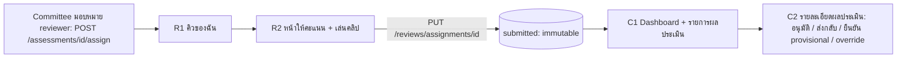

# Demo slice 2 (bl-22): Reviewer ให้คะแนน + Committee ตรวจ/อนุมัติผลประเมิน

> Pam · 2026-10-07 · พร้อมสร้าง (markdown-first, ไม่รอ Stitch) · ชื่อฟิลด์/endpoint ตาม `docs/api/openapi.yaml` บน develop · ไม่แก้หน้าจอของ slice 1 · ยึด `contract-alignment.md`/`v3-umpire-grading-v2.md` เมื่อขัดกัน
> สถานะ: [WAITING FOR OWNER APPROVAL] · UI **แสดงผลที่ API ส่งมาเท่านั้น** (score/lower/upper/label/flags/kappa) ห้ามคำนวณสถิติเอง

## 0. ผังเส้นทาง



บทบาท: R1–R2 = Reviewer (Committee ที่ถูกมอบหมายก็ใช้ได้ ตาม conflict rule) · C1–C2 = Committee (Admin ดูอย่างเดียว ถ้า API อนุญาต; ซ่อนปุ่มแก้) · **blind**: ฝั่ง Reviewer API ไม่ส่ง assessment id/ผู้ถูกประเมิน/ชนิดงาน (assessment vs calibration) — UI แสดงรหัสงานเป็น "งาน #…" จาก assignment id เท่านั้น

---

## R1 คิวของฉัน (Reviewer) — `/review`

- API: `GET /reviews/assignments/me?state=open|submitted|expired` → `ReviewAssignment {id, state open|submitted|expired|declined, dueAt, submittedAt}`
- Mobile-first

```
┌────────────────────────┐
│ คิวของฉัน   เสร็จ 3/12  │
│ ▓▓▓░░░░░░░ 25%          │
│ [ยังไม่ทำ 8][ส่งแล้ว 3][หมดเวลา 1]│
│ ┌ งาน #A3F2 ───────────┐│
│ │ ส่งภายใน 5 พ.ย. 18:00 ││
│ │ [ยังไม่ทำ]   [เริ่ม]   ││
│ └──────────────────────┘│
└────────────────────────┘
```

| State | แสดง |
|---|---|
| loading | skeleton การ์ด |
| ว่าง (ยังไม่ได้รับมอบหมาย) | "ยังไม่มีงานให้ตรวจ — จะแจ้งเมื่อมีการมอบหมาย" |
| ทำครบ | "ตรวจครบแล้ว" + สรุปจำนวน (ไอคอน ไม่ใช้อีโมจิ) |
| `expired` | ป้าย "หมดเวลา" (ไอคอน+ข้อความ) ปุ่มปิด; ไม่ส่งได้ |
| `declined` | ป้าย "ปฏิเสธแล้ว" อ่านอย่างเดียว |
| ใกล้กำหนด (< 24 ชม.) | ไอคอนนาฬิกา + "เหลือ N ชม." |
| error | ErrorBanner + ลองใหม่ |
| เรียงลำดับ | ใกล้ครบกำหนดก่อน |

Components: ReviewCard (`assignmentId`, `state`, `dueAt`, `onOpen`), ProgressBar, Tabs(filter), StatusBadge, EmptyState, ErrorBanner

---

## R2 หน้าให้คะแนน + เล่นคลิป (Reviewer) — `/review/:assignmentId`

- API: `GET /reviews/assignments/{id}` → `ReviewAssignmentDetail {…, clips[Clip{id,status,viewUrl,durationSec}], rubric{methodVersion, criteria[{key,nameTh,weight,anchorsTh{tier→คำอธิบาย}}]}, myScores[CriterionScore{criterion,gradeKey|null}]}` · ส่ง `PUT /reviews/assignments/{id}` body `ReviewInput {scores[], comment≤2000}` (ครั้งเดียว, แก้ไม่ได้หลังส่ง) · ปฏิเสธ `POST /reviews/assignments/{id}/decline` (ReasonInput)
- **ไม่มี draft ฝั่งเซิร์ฟเวอร์**: ร่างเก็บใน browser storage ต่อ assignment — แสดงป้าย "ร่างอยู่ในเครื่องนี้เท่านั้น" เสมอ
- **คะแนนต่อหัวข้อ = เลือก 1 ขั้นจาก 15 ขั้น (RK1..P+) จัดกลุ่ม 5 tier หรือ "ประเมินไม่ได้" (`gradeKey: null`)** ไม่ใช่ 1–5

### Layout

มือถือ 360: player ติดบน (sticky สูง ~40% จอ) → ความคืบหน้า → การ์ดหัวข้อเลื่อน → ความเห็นรวม → แถบล่าง sticky. Desktop ≥ 1024: 2 คอลัมน์ player ซ้าย (sticky) / rubric ขวา

```
┌────────────────────────┐
│ ← คิว   งาน #A3F2   2/12│
│ ┌────────────────────┐ │
│ │   [ คลิปวิดีโอ ]     │ │
│ │ ▶ 0:12 ──●── 0:47  │ │
│ │ ⟲5s   0.5x 1x 1.5x │ │
│ │ คลิป [1][2][3]      │ │
│ └────────────────────┘ │
│ ให้คะแนนแล้ว 3/6 ▓▓▓░░░ │
│ ┌ 1 ฟุตเวิร์ก ────────┐│
│ │ [Rookie][Beginner][Standard✓][Neutral][Pro]│
│ │   ขั้นย่อย  [S-][S ✓][S+]                  │
│ │ "คำอธิบายระดับ Standard…" (anchor)         │
│ │ [ประเมินไม่ได้]                             │
│ └──────────────────────┘│
│ ┌ 2 ลูกเหนือศีรษะ  (ยังไม่เลือก)┐              │
│ …                       │
│ ความเห็นรวม [__________] │
├────────────────────────┤
│ ร่างอยู่ในเครื่องนี้ ✓   [ส่งและล็อก] │ ← sticky
└────────────────────────┘
```

### พฤติกรรม

| เรื่อง | กติกา |
|---|---|
| เลือกเกรด (GradePicker `tiered`) | แตะ tier (5 ปุ่ม สี+ข้อความ) → แสดงขั้นย่อย 3 ปุ่ม (ขั้นเดียว tier Rookie/Beginner = RK1–3/BG1–3 ฯลฯ) → ค่า `gradeKey` · เลือกซ้ำ = คงเดิม ใช้ปุ่ม "ล้าง" · desktop แสดงบันไดแถวเดียว 15 ปุ่มจัดกลุ่ม (variant `ladder`) |
| anchor | แสดง `anchorsTh[tier]` ของ tier ที่เลือก/โฟกัส |
| "ประเมินไม่ได้" | ตั้ง `gradeKey: null` ของหัวข้อนั้น (นับว่าตอบแล้ว) แสดงป้ายชัด + ปุ่มเลิก |
| น้ำหนัก | แสดง "น้ำหนัก ×w" แบบข้อความเล็ก (ค่าสัมพัทธ์ ไม่บังคับรวม 100) |
| player | URL จาก `clips[].viewUrl` (presigned หมดอายุสั้น): เมื่อ error/403 ขอ detail ใหม่ 1 ครั้งอัตโนมัติ เล่นต่อที่เวลาเดิม; ล้มเหลวซ้ำ → ข้อความ + "ลองใหม่" + "ปฏิเสธงานนี้ (คลิปเล่นไม่ได้)"; หลายคลิป = แท็บ 1–3; ย้อน 5 วิ; ความเร็ว 0.5/1/1.5; คีย์ Space/←/→ บน desktop; ไม่บังคับดูจบ |
| บันทึกร่าง | ท้องถิ่นอัตโนมัติ (debounce) + ป้าย "บันทึกในเครื่องแล้ว HH:MM" |
| ส่ง | เปิดเมื่อทุกหัวข้อมีค่า (เกรดหรือ ประเมินไม่ได้) → dialog สรุปคะแนนต่อหัวข้อ → "ส่งและล็อก" → `PUT` → สำเร็จ: ไปงานถัดไป/คิว |
| ปฏิเสธงาน | ปุ่มรอง "ปฏิเสธงานนี้" → เหตุผลบังคับ → `decline` |

### States

| State | แสดง |
|---|---|
| loading | skeleton player + rubric |
| ปกติ/กรอกบางส่วน | ตามด้านบน; ปุ่มส่ง disabled + บอกเหลือกี่หัวข้อ |
| ครบ | ปุ่มส่ง active |
| submitting | ปุ่ม disabled |
| submitted | read-only แสดงคะแนนที่ส่ง + ป้าย "ส่งแล้ว" (ไม่เห็นผลรวม/คนอื่น) |
| `REVIEW_ALREADY_SUBMITTED` (409) | "ส่งไปแล้ว" → โหมด submitted |
| `ASSIGNMENT_EXPIRED` (409) | "หมดเวลาแล้ว" ล็อก; ร่างยังเก็บในเครื่องแต่ส่งไม่ได้ |
| clip pending/rejected | "คลิปยังไม่พร้อม" + ปุ่มรีเฟรช; ปฏิเสธงานได้ |
| ออฟไลน์ | แบนเนอร์; ร่างอยู่ต่อ; ส่งไม่ได้จนกลับมา |
| ร่างต่างอุปกรณ์ | ไม่มี sync — ข้อความช่วยตอนเปิดครั้งแรกบนเครื่องอื่น: "ร่างจากเครื่องอื่นไม่แสดงที่นี่" |
| 403/404 | ไม่มีสิทธิ์/ไม่พบงาน |

Accessibility: GradePicker เป็น radio group (ลูกศร), ไม่พึ่งสีอย่างเดียว (ตัวย่อเกรด+✓), ปุ่ม ≥ 44px, ปุ่ม player มี label

Components: ClipPlayer (`clips`, `onError`, `onTimeUpdate?`; variants `native` เท่านั้น — ไม่มี embed ตาม contract), GradePicker (`value:GradeKey|null`, `allowNA`, `anchorsByTier`, `onChange`, `disabled`; variants `tiered` `ladder`), RubricItemCard (`criterion`, `value`, `onChange`, `readOnly`), ProgressBar, StickyActionBar, SaveLocalDraftNotice, ConfirmDialog(reason ในกรณี decline), ErrorBanner

---

## C1 Dashboard ผลประเมิน (Committee) — `/committee/assessments`

- API: `GET /assessments?status=&subjectUserId=&sort=createdAt:desc` (Committee เห็นทั้งหมด) → `Assessment {id, subjectUserId, eventId|null, status, reviewsSubmitted, reviewsRequired, createdAt, updatedAt}` · `GET /rater-stats?window=30d|90d|365d|all` → `RaterStats {panel.fleissKappaTier, raters[{reviewerId,reviews,bias,kappaVsConsensus,outlierRate,flagged}], pairs[{a,b,cohenKappaQuadratic}]}` (`AgreementValue {kappa|null, n, band poor|fair|moderate|substantial|almost_perfect|insufficient}`)

```
┌────────────────────────────────────────────────────┐
│ ผลประเมิน    ช่วงสถิติ [90 วัน ▼]                    │
│ [รอ reviewer 4][กำลังรีวิว 7][ชั่วคราว 3][เห็นต่าง 2][รออนุมัติ 5]│  ← StatTile = ตัวกรอง status
├────────────────────────────────────────────────────┤
│ ความสอดคล้อง Fleiss (panel): 0.62 [ปานกลาง] n=24   │
│ ┌ Pair matrix ──────────────────────────────────┐ │
│ │      R1    R2    R3                           │ │
│ │ R1   –    0.78  —(n<10)                       │ │
│ │ R2  0.78   –    0.52 ⚠ ต่ำ                    │ │
│ └───────────────────────────────────────────────┘ │
│ ผู้ประเมิน: ชื่อ · reviews · bias · kappa vs ที่ปรึกษา · outlier% · [ธง]│
├────────────────────────────────────────────────────┤
│ รายการผลประเมิน  [สถานะ ▼] [ค้นหา]                  │
│ ผู้ถูกประเมิน   สถานะ         รีวิว  ผล(label)  ธง │
│ สมชาย          [ชั่วคราว]     1/1   S-–S+ wide  ⚑SINGLE_REVIEWER│
│ วิภา           [เห็นต่าง]     3/3   S-–N- wide  ⚑HIGH_DISAGREEMENT│
└────────────────────────────────────────────────────┘
```

กติกา:
- StatTile (นับต่อสถานะ): `needs_reviewers`, `in_review`, `provisional`, `disputed`, `pending_approval` — กดแล้วกรองตาราง; ข้อความ+ไอคอนเสมอ
- **ป้ายสถานะ** (ข้อความ+ไอคอน): provisional = "ชั่วคราว (กรรมการ 1 คน)", disputed = "เห็นต่างกันมาก", pending_approval = "รออนุมัติ", needs_reviewers = "ต้องหากรรมการเพิ่ม", approved/overridden
- **PairMatrix:** ทุกช่องแสดงตัวเลข kappa + ระดับ `band` เป็นข้อความ/ไอคอน; `kappa: null`/`insufficient` → "—" + tooltip "ข้อมูลร่วมไม่พอ"; ห้ามใช้สีอย่างเดียว; แตะช่อง = รายการเคสร่วมของคู่ (ถ้า API มี; ไม่งั้นปิดไว้)
- ตารางผู้ประเมิน: `bias` แสดงเป็น "+0.4 ขั้น (เข้มน้อยกว่าฉันทามติ)" แบบข้อความทิศทาง; `flagged` = ธง "ควรทบทวน"
- ผลย่อ: ใช้ `GradeBand` จาก `latestResult.grade` (label + lower–upper + kind) — **ถ้า `latestResult` เป็น null** (ยังสรุปไม่ได้, G15) แสดง "ยังสรุปไม่ได้" ไม่สร้างตัวเลข

| State | แสดง |
|---|---|
| loading | skeleton tile/ตาราง |
| ว่าง | "ยังไม่มีผลประเมิน" |
| ไม่มีสถิติ (n น้อย) | "ยังไม่มีข้อมูลสอดคล้อง — ต้อง ≥ 2 reviewer และเคสร่วมตามเกณฑ์" |
| error บางส่วน | การ์ดที่ล้มเหลวแสดง error แยก ส่วนอื่นใช้ได้ |
| ผลล้าสมัย | ป้าย "คำนวณล่าสุด HH:MM" + รีเฟรช |
| ไม่ใช่ Committee | 403 (Admin: ถ้าอนุญาต ดูได้ ซ่อนปุ่มแก้) |

Components: StatTile (ปุ่มกรอง), AgreementMatrix, RaterTable (ใหม่), AssessmentTable (DataTable), StatusBadge(assessment), FlagChip, GradeBand, EmptyState, ErrorBanner, Select

---

## C2 รายละเอียดผลประเมิน + การตัดสินใจ (Committee) — `/committee/assessments/:id`

- API: `GET /assessments/{id}` → `AssessmentDetail {…, clips, latestResult{version, source computed|override, status, grade GradeView, nRaters, nExcluded, spread, flags[OUTLIER_EXCLUDED|HIGH_DISAGREEMENT|LOW_RATER_COUNT|OVERRIDE|SINGLE_REVIEWER|PAIR_DISAGREEMENT], methodVersion, reason}, reviewerRows[{reviewerId, reviewerName, overall, excluded, robustZ|null, reviewerBias|null, pairKappa|null, criteria[]}]}`
- การกระทำ: `POST /assessments/{id}/approve` (pending_approval|disputed→approved; มีหมายเหตุ) · `/return` (ReasonInput → in_review) · `/confirm` (provisional→approved) · `/override` (ผลใหม่ source=override, เหตุผล ≥ 20 ตัวอักษร) · `/assign` (เพิ่ม reviewer; conflict ตรวจฝั่งเซิร์ฟเวอร์)

```
┌────────────────────────────────────────────────┐
│ ← สมชาย   [ชั่วคราว (กรรมการ 1 คน)]              │
│ ผล:  S-–S+  (wide)   score 7.83 ±1.00           │
│ ⚑ SINGLE_REVIEWER "ประเมินโดยกรรมการ 1 คน"      │
│ [ยืนยันผล]  [ส่งกลับให้รีวิวเพิ่ม…]  [Override…] │
├────────────────────────────────────────────────┤
│ คลิป [1][2]  ▶ (ClipPlayer)                      │
├────────────────────────────────────────────────┤
│ คะแนนกรรมการ (แกนเดียวกับ band RK1…P+)           │
│ R1 ชื่อ  ●S/S+      overall 7.83  ใช้          │
│ R2 ชื่อ  ●N-        overall 9.50  ตัดออก ⚑OUTLIER_EXCLUDED  z=3.9│
│ pairKappa (คู่ R1–R2): 0.52 [ปานกลาง] n=14       │
│ bias ของ R2: +0.6 ขั้น                           │
│ ▸ ต่อหัวข้อ (ขยาย): footwork S / N- …            │
├────────────────────────────────────────────────┤
│ ประวัติเวอร์ชันผล (version, source, เหตุผล, เวลา) │
└────────────────────────────────────────────────┘
```

กติกาปุ่มตามสถานะ (UI ซ่อน/ปิดปุ่มที่ API ไม่รองรับ พร้อมข้อความเหตุผล):

| สถานะ | ปุ่มที่เปิด | หมายเหตุ UI |
|---|---|---|
| `provisional` | ยืนยัน (confirm) · ส่งกลับ · override · มอบหมายเพิ่ม | ป้ายชัด "ยังไม่ใช้สมัคร/จัด seed จนกว่ายืนยัน" |
| `disputed` | อนุมัติ (ต้องมีหมายเหตุ) · ส่งกลับ (หาคนเพิ่ม) · override · มอบหมายเพิ่ม | แสดง spread/margin และธง `HIGH_DISAGREEMENT`/`PAIR_DISAGREEMENT` + ข้อเสนอ "มอบหมายกรรมการคนที่ 3" (ปุ่ม assign) |
| `pending_approval` | อนุมัติ · ส่งกลับ · override | |
| `needs_reviewers`/`in_review` | มอบหมายเพิ่ม | ไม่มีปุ่มอนุมัติ |
| `approved`/`overridden` | override (สร้างเวอร์ชันใหม่) | อ่านอย่างเดียวนอกนั้น |

- **ConfirmDialog(reason)**: ส่งกลับ ≥ ตาม ReasonInput; override **≥ 20 ตัวอักษร** + แสดงสรุป "ผลเดิม → ผลใหม่" (ผลใหม่กรอกเป็น GradePicker + margin ตามที่ API กำหนด — TBD: ดู body ของ /override); หลังสำเร็จ toast + เวอร์ชันใหม่ในประวัติ
- ธง conflict ของ reviewer แสดงตอน assign (เหตุผลจาก 409 ของเซิร์ฟเวอร์ ไม่เดาเอง)
- Committee ที่เป็นผู้ถูกประเมิน/ทีมเดียวกัน: ปุ่มตัดสินปิด + ข้อความ (ยึดผลจากเซิร์ฟเวอร์)
- reviewerName แสดงเฉพาะหน้านี้ (Committee); Reviewer ไม่เห็น

| State | แสดง |
|---|---|
| loading/error | skeleton / ErrorBanner |
| `latestResult: null` | "ยังสรุปไม่ได้" + สถานะ + ปุ่มมอบหมายเพิ่ม |
| ชนกัน (Committee อื่นดำเนินการแล้ว) | "ผลนี้ถูกดำเนินการแล้ว" รีเฟรช |
| ข้อมูลสถิติน้อย | robustZ/pairKappa/bias แสดง "—" + คำอธิบาย |
| submitting | ปุ่ม disabled + spinner; ล้มเหลวคืนค่า |

Components: AssessmentHeader (ใหม่), GradeBand (variant `detail`: score, margin, lower–upper, kind), ReviewerScoreList (ใหม่; แถบจุดบนแกน RK1…P+ + overall + excluded/robustZ/bias), FlagChip, ClipPlayer, VersionHistory (AuditTrail variant), ConfirmDialog(reason, minReasonLength), GradePicker(สำหรับ override), AssignReviewerDialog (ใหม่), StatusBadge, ErrorBanner

---

## ลำดับสร้างสำหรับ Andy

1. GradePicker (tiered/ladder) + RubricItemCard + SaveLocalDraftNotice (ท้องถิ่น) → R2 (ใช้ mock detail ก่อนถ้าจำเป็น)
2. ClipPlayer (native, presigned refresh) → R1 → R2 ครบ (submit/decline)
3. StatusBadge(assessment) + FlagChip + GradeBand(detail) + StatTile(filter)
4. AssessmentTable + C1 (RaterTable, AgreementMatrix)
5. C2 (ReviewerScoreList, ConfirmDialog reason, AssignReviewerDialog) ตามกติกาปุ่มต่อสถานะ
6. ทดสอบ end-to-end: มอบหมาย 1 reviewer → ส่งคะแนน → Committee ยืนยัน provisional; มอบหมาย 2–3 reviewer → disputed → อนุมัติ/override

## คำถามเปิดสำหรับ Jim (ไม่ขวางการสร้าง)

1. body ของ `/override` (grade/margin/reason) และ `/approve` (note) — ขอชื่อฟิลด์ตรง ๆ
2. endpoint รายการเคสร่วมของคู่ reviewer (drill-down ของ PairMatrix) มีไหม
3. `GET /assessments` ส่ง `latestResult` หรือ label ย่อในรายการไหม (ถ้าไม่ ตารางต้องโหลด detail ต่อแถว — ขอ field label ในรายการ)
4. ชื่อผู้ถูกประเมินให้ Committee เห็น (displayName) ในรายการ — ขอ `subject` ย่อใน Assessment
