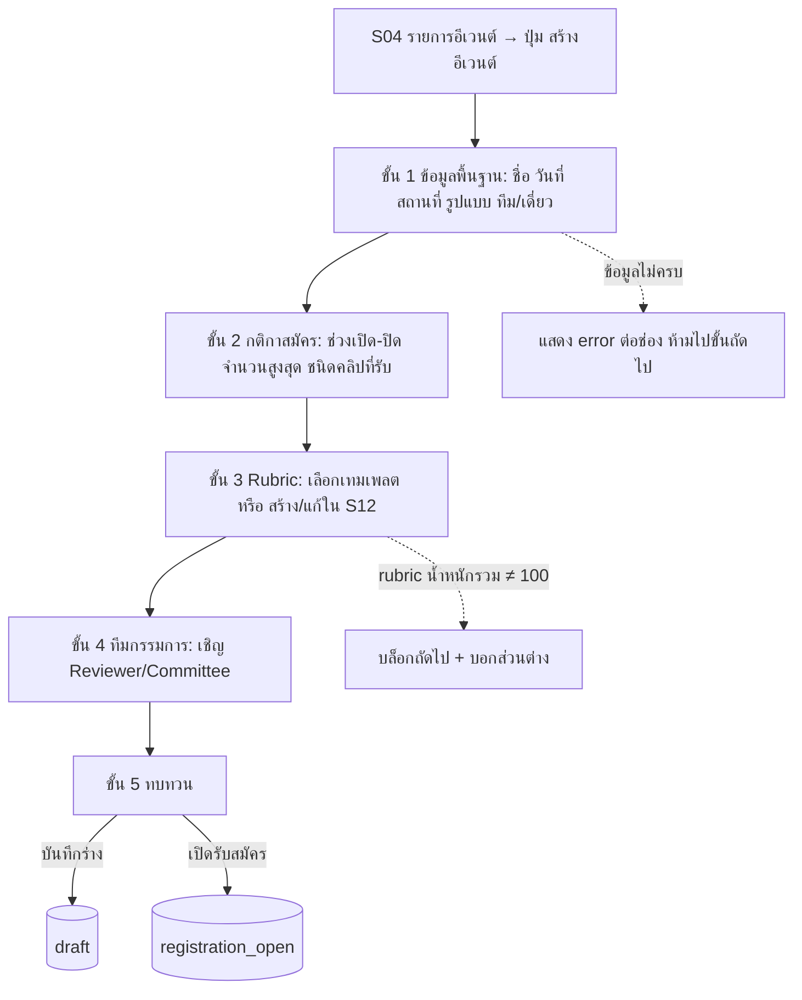
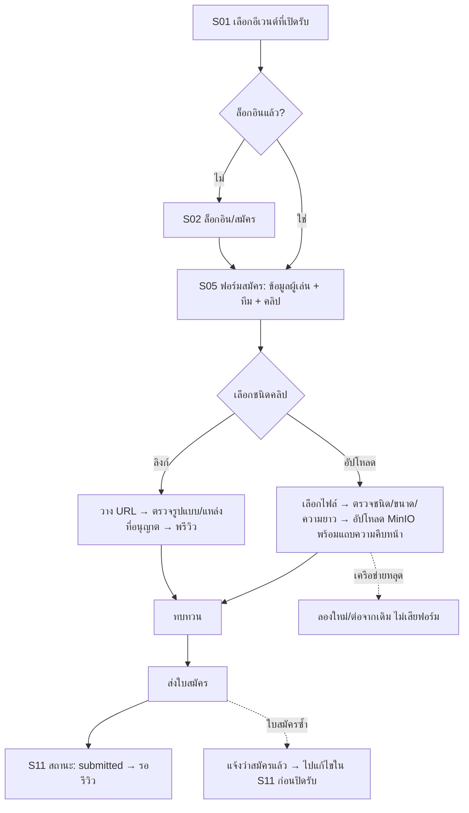
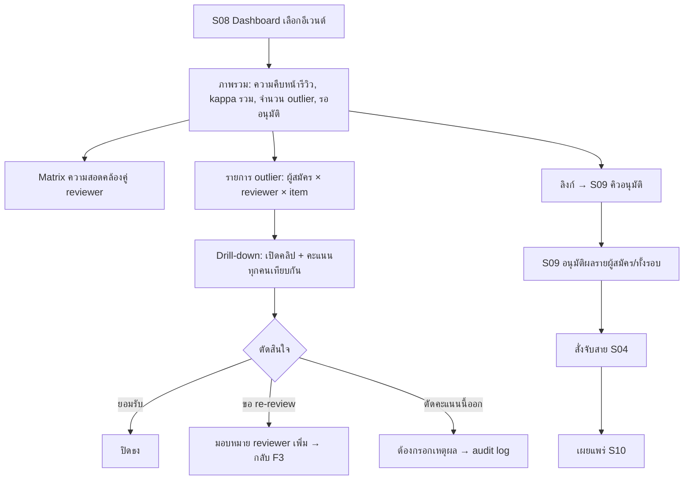
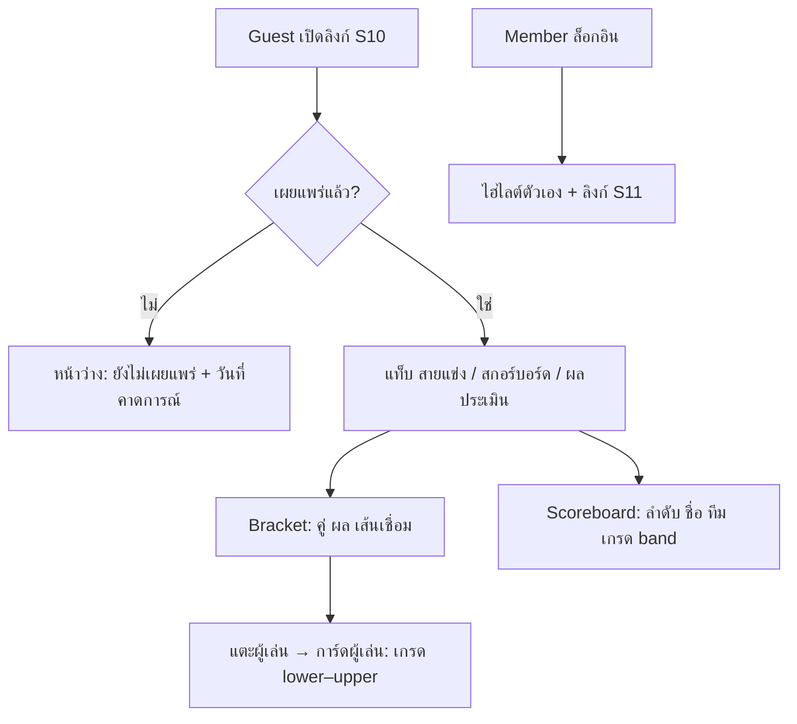
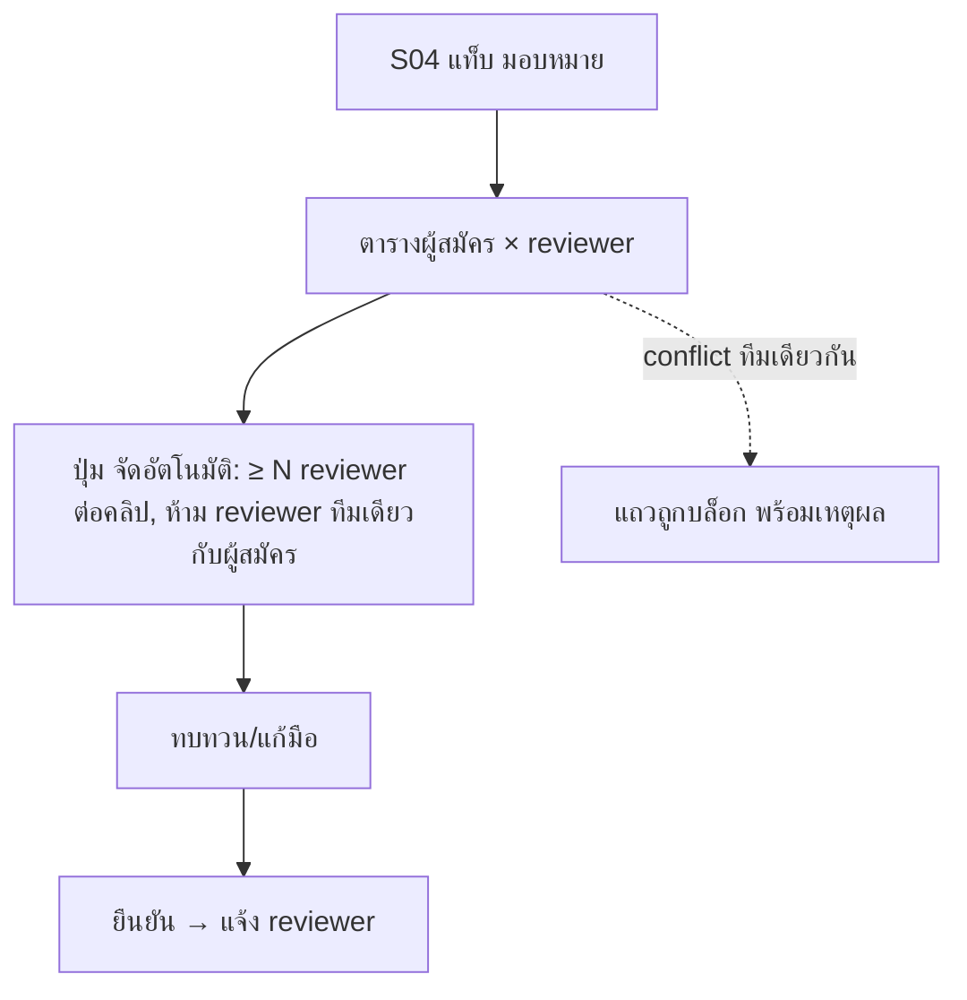

# Flows — blulens

> ⚠ **ถูกกำกับโดย `contract-alignment.md` (v2)** — ข้อความที่ขัดกับไฟล์นั้น (สเกล 15 ขั้น, upload-only, สิทธิ์ Admin/Committee, outlier, สถานะรีวิว/อีเวนต์, การมองเห็นเกรดของ Guest) ให้ยึดไฟล์นั้น

> ทุกแผนภาพเป็น mermaid (เรนเดอร์ใน GitHub). ดูบทบาทและ screen id ใน `README.md`. สถานะ: ร่างรออนุมัติ.

## F0 ภาพรวมวงจรอีเวนต์

```mermaid
flowchart LR
  A[Admin สร้างอีเวนต์ + rubric] --> B[เปิดรับสมัคร]
  B --> C[Member สมัคร + แนบคลิป]
  C --> D[ปิดรับสมัคร]
  D --> E[Committee มอบหมาย Reviewer]
  E --> F[Reviewer ให้คะแนน blind]
  F --> G[ระบบคำนวณ score/lower/upper + kappa + outlier]
  G --> H[Committee ตรวจ dashboard + อนุมัติ]
  H --> I[จับสาย draw: ห้ามทีมเดียวกันเจอกันรอบแรก]
  I --> J[เผยแพร่สายแข่ง/สกอร์บอร์ด]
  J --> K[Guest/Member ดูผล]
```



สถานะอีเวนต์: `draft → registration_open → registration_closed → reviewing → approved → bracket_published → completed` (ชื่อสถานะ TBD-API). ปุ่ม/หน้าจอที่ใช้ได้ผูกกับสถานะนี้.

## F1 สร้างอีเวนต์ (Admin) — S03 → S12 → S04



## F2 สมัคร + แนบคลิป (Member) — S01 → S02 → S05 → S11



กติกา: แก้คลิป/ข้อมูลได้จนถึงปิดรับสมัคร; หลังปิดเป็น read-only. ฟอร์มบันทึกร่างอัตโนมัติ (ต่อผู้ใช้ ต่ออีเวนต์).

## F3 Reviewer ให้คะแนน — S06 → S07

```mermaid
flowchart TD
  Q[S06 คิวของฉัน: ทั้งหมด/ยังไม่ทำ/ร่าง/ส่งแล้ว] --> P[S07 เปิดคลิปตัวถัดไป]
  P --> V[เล่นคลิป: เล่น/หยุด/ย้อน 5 วิ/ความเร็ว 0.5x-1x-1.5x]
  V --> I[ให้คะแนนทีละ rubric item: แตะ 1..N + โน้ตหรือ timestamp ได้]
  I --> AS[บันทึกร่างอัตโนมัติ + แสดงความคืบหน้า 3/6 items]
  AS --> SB{ครบทุก item?}
  SB -->|ไม่| I
  SB -->|ใช่| CF[ยืนยันส่ง: สรุปคะแนน]
  CF -->|ส่ง| LK[(locked) → ไปคลิปถัดไป]
  CF -->|ย้อนแก้| I
  V -.คลิปเล่นไม่ได้.-> BR[ปุ่ม รายงานคลิปเสีย → Committee] --> Q
  LK -.ต้องแก้ภายหลัง.-> UN[Committee ปลดล็อกพร้อมเหตุผล → audit log]
```

Reviewer ไม่เห็น `score/lower/upper` ของผลรวมและคะแนนคนอื่นจนกว่า Committee อนุมัติผล (D3).

## F4 Super-Committee: ตรวจและอนุมัติ — S08 → S09



## F5 สายแข่ง/สกอร์บอร์ดสาธารณะ — S10



## F6 มอบหมาย Reviewer (Committee) — S04 แท็บ "กรรมการ"



## Error ร่วมทุก flow

| กรณี | พฤติกรรม |
|---|---|
| session หมดอายุ | พาไป S02 แล้วกลับหน้าเดิม (ร่างไม่หาย) |
| 403 บทบาทไม่พอ | หน้า "ไม่มีสิทธิ์" + ปุ่มกลับ; ไม่เผยว่ามีทรัพยากรอยู่หรือไม่ |
| 404 | หน้า "ไม่พบ" |
| ออฟไลน์/เครือข่ายหลุด | แบนเนอร์ค้าง; ร่างเก็บในเครื่อง; ส่งซ้ำเมื่อกลับมา (idempotent) |
