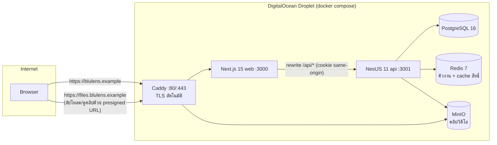
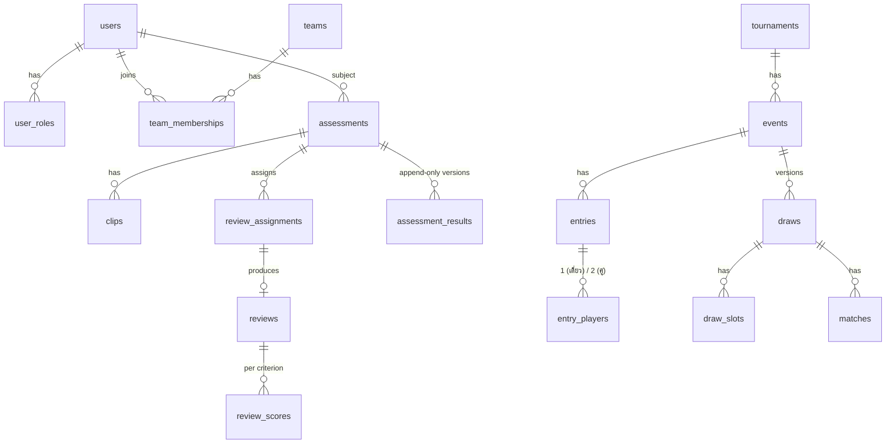

# สเปกสถาปัตยกรรมระบบ blulens (bl-02)

> สถานะ: **v1.1 — เจ้าของอนุมัติแล้ว 2026-10-07** (v1.1: เพิ่ม role **Umpire** ตามที่เจ้าของอนุมัติใน bl-17 F12) · (A1–A14; แก้ตามเจ้าของ 4 ข้อ: A8, A11, A13 = ค, A14 — ดู §10) · เปลี่ยนสเปกนี้ต่อจากนี้ต้องผ่าน god → เจ้าของ
> ผู้เขียน: Jim (Lead Dev) · 2026-10-07 · สัญญา API ตัวจริง: [`docs/api/openapi.yaml`](../api/openapi.yaml)
> สเปกที่เกี่ยวข้อง: [`grading.md`](grading.md) (bl-03 ระบบประเมินมือ) · [`draw.md`](draw.md) (bl-04 ระบบจับสาย)
> อ้างอิงแบบแผน: `kpaccv2` (stack + deploy) · `bad8bit` (รูปแบบผลเกรด lower/upper/score เท่านั้น)

## 1. ภาพรวมใน 1 นาที

blulens คือเว็บจัดการแข่งแบดมินตันที่มี 2 หัวใจ:

1. **ประเมินมือแบบหลายกรรมการ** — นักกีฬาส่งคลิป → กรรมการ ≥ 3 คนให้คะแนนแบบไม่เห็นกันตาม rubric → ระบบรวมคะแนน ตัดคะแนนโดด วัดความสอดคล้องของกรรมการ (Kappa) → ได้ผล `score` + `lower` + `upper` → Super-Committee อนุมัติ
2. **จับสายอัตโนมัติ** — ใช้เกรดที่อนุมัติแล้วเป็นตัววางมือวาง (seed) และ **ไม่ให้คนทีมเดียวกันเจอกันรอบแรก** สุ่มแบบตรวจสอบย้อนได้ (มี seed + audit log)

ทั้งหมดรันบน **DigitalOcean Droplet เครื่องเดียว** หลัง Caddy (HTTPS อัตโนมัติ)

## 2. โครง Monorepo (ตาม kpaccv2)

| โฟลเดอร์ | หน้าที่ | กติกา |
|---|---|---|
| `apps/api` | NestJS 11 + Prisma — REST API, สิทธิ์, business logic, worker คิวงาน | ห้ามมีตรรกะคำนวณสถิติ/จับสายซ้ำกับ shared — เรียกจาก shared |
| `apps/web` | Next.js 15 App Router — UI ภาษาไทย สไตล์ pixel ของ bad8bit | ไม่มี business logic; เรียก API ผ่าน rewrite เท่านั้น |
| `packages/shared` | zod schema (ต้นทางของ type) + **pure domain logic**: บันไดเกรด, สูตรรวมคะแนน/outlier/kappa, ตัวจับสาย, PRNG | ฟังก์ชัน pure ไม่แตะ DB/เวลา/สุ่มของระบบ → เทสต์ได้ด้วยตัวเลขตายตัว |
| `docs/` | สเปก (`specs/`), สัญญา API (`api/openapi.yaml`), ดีไซน์ (`design/` ของ Pam), QA (`qa/` ของ Dwight) | สเปกภาษาไทย; โค้ด/commit อังกฤษ |
| `deploy/` | `Caddyfile`, `docker-compose.yml`, `.env.example` | ไม่มีค่าลับใน repo |

> เหตุผลที่สูตรอยู่ใน `packages/shared`: สูตรคือสิ่งที่เจ้าของอนุมัติ ต้องอยู่ที่เดียว เทสต์ได้ทีละสมการ และหน้าเว็บแสดง "ทำไมได้เกรดนี้" ด้วยสูตรเดียวกับเซิร์ฟเวอร์ (แต่ **ผลที่บันทึกคำนวณที่เซิร์ฟเวอร์เท่านั้น**)

## 3. บทบาท (Roles) และสิทธิ์

| Role | คือใคร | ทำอะไรได้ (หลัก ๆ) | ทำไม่ได้ |
|---|---|---|---|
| **Admin** | ผู้ดูแลระบบ | จัดการผู้ใช้/บทบาท, ตั้งค่าระบบ, ดู audit ทั้งหมด | ไม่ให้คะแนน/อนุมัติเกรดเอง (แยกหน้าที่) — ยกเว้นถือ role Committee ด้วย |
| **Committee** (Super-Committee) | คณะกรรมการกลาง | มอบหมายกรรมการ, อนุมัติ/ส่งกลับผลประเมิน, **override เกรด** (ต้องมีเหตุผล), สร้างรายการแข่ง, จับสาย/เผยแพร่สาย, ดูสถิติกรรมการ | override ผลของตัวเอง/คนในทีมตัวเอง |
| **Umpire** (กรรมการสนาม) | ผู้กรอกผลแมตช์หน้าสนาม | กรอก/แก้ผลแมตช์ที่ได้รับมอบหมาย (สถานะ "รายงานแล้ว" รอ Committee ยืนยัน) | กรอกผลแมตช์ของตัวเอง, ยืนยันผล, ให้คะแนนประเมินมือ, จับสาย |
| **Reviewer** | กรรมการให้คะแนน | ดูคลิปที่ได้รับมอบหมาย, ส่งคะแนน rubric, ดูสถิติความสอดคล้องของตัวเอง | เห็นคะแนนคนอื่นก่อนตัวเองส่ง; ประเมินตัวเองหรือคนทีมเดียวกัน |
| **Member** | นักกีฬา/สมาชิก | โปรไฟล์, สังกัดทีม, ขอประเมิน+อัปคลิป, ดูผลของตัวเอง, สมัครแข่ง | เห็นคะแนนรายกรรมการ (เห็นแค่ผลรวม — ดู decision A4) |
| **Guest** | ไม่ได้ล็อกอิน | ดูรายการแข่ง, สายแข่งที่เผยแพร่, ผลการแข่ง, เกรดของ entry ที่เปิดเผย (§6.8) | ดูเกรดที่ไม่ได้เปิดเผย |

**ตารางสิทธิ์จริง (ไม่ใช่ลำดับชั้นแบบ superset — แต่ละ role มีชุดของตัวเอง ผู้ใช้หลาย role ได้สิทธิ์รวมแบบ union):**

| ความสามารถ | Guest | Member | Reviewer | Umpire | Committee | Admin |
|---|---|---|---|---|---|---|
| ดูรายการแข่ง/สายที่เผยแพร่/ผลแข่ง | ✓ | ✓ | ✓ | ✓ | ✓ | ✓ |
| ดู rubric ที่ใช้อยู่ | ✓ | ✓ | ✓ | ✓ | ✓ | ✓ |
| โปรไฟล์ตัวเอง, ขอประเมิน, อัปคลิป, ดูผลตัวเอง (ผลรวม), สมัครแข่ง/ถอนตัว | – | ✓ | – | – | – | – |
| คิวงานรีวิวของตัวเอง, ดูคลิปที่ได้รับมอบหมาย, ส่ง/ปฏิเสธรีวิว, ดูสถิติตัวเอง | – | – | ✓ | – | – | – |
| มอบหมายกรรมการ, ดูคะแนนรายกรรมการ, อนุมัติ/ส่งกลับ/override, สถิติกรรมการทั้งหมด | – | – | – | – | ✓ | – |
| สร้างทีม/ผูก alias ทีม, สร้างรายการแข่ง/ประเภท, จับสาย/เผยแพร่/สุ่มใหม่ | – | – | – | – | ✓ | ✓ (ทีมเท่านั้น) |
| แก้ rubric (สร้างเวอร์ชันใหม่ — หน้า S12) | – | – | – | – | ✓ | – |
| ตั้งค่าเปิด/ปิดเกรดของ entry ตัวเอง (ให้ความยินยอม) | – | ✓ | – | – | – | – |
| เปิดเผยเกรดทั้งรายการแข่ง/ประเภทเพื่อความโปร่งใส (ต้องมีเหตุผล, ลง audit) | – | – | – | – | ✓ | ✓ |
| จัดการผู้ใช้/role, ดู audit log ทั้งหมด | – | – | – | – | – | ✓ |
| กรอก/แก้ผลแมตช์ที่ได้รับมอบหมาย (รายการแข่ง/สนามที่ถูกมอบหมาย) → สถานะ "รายงานแล้ว" | – | – | – | ✓ | ✓ (กรอกตรง = ยืนยันทันที) | – |
| ยืนยัน/ตีกลับผลแมตช์, แก้ผลที่ยืนยันแล้ว (ลง audit), มอบหมายกรรมการสนาม | – | – | – | – | ✓ | – |

- Guest = ผู้ที่ไม่ได้ล็อกอิน ไม่มีบัญชีชนิด Guest ใน DB
- ผู้ใช้ 1 คนถือได้หลาย role (เช่น Reviewer + Member) — สิทธิ์เป็น string `resource.action` แบบ kpaccv2 (ทะเบียนกลางใน `packages/shared`) แต่ **role ของ blulens ตายตัว 6 ตัว** (Admin, Committee, Umpire, Reviewer, Member, Guest) ไม่ให้สร้าง role เอง (decision A2)
- กฎ conflict of interest (บังคับที่ API ไม่ใช่แค่ซ่อนปุ่ม): กรรมการ/คณะกรรมการ ห้ามแตะผลของตัวเองหรือคนที่สังกัด **ทีมใดทีมหนึ่งร่วมกัน** ณ วันที่มอบหมาย (ผู้เล่นมีได้หลายทีม — A11)

## 4. โมดูลฝั่ง API

| โมดูล | ความรับผิดชอบ | ตารางหลัก |
|---|---|---|
| `auth` | ล็อกอิน/สมัคร, JWT ใน httpOnly cookie + refresh rotation (ลอก kpaccv2) | `users`, `refresh_tokens` |
| `users` | โปรไฟล์, role ของผู้ใช้ | `users`, `user_roles` |
| `teams` | ทีม/สโมสร, alias, คำขอเพิ่มทีม, การสังกัด (หลายทีมพร้อมกันได้ มีช่วงวันที่ — ใช้ตัดสิน "ทีมเดียวกัน" ณ วันจับสาย) | `teams`, `team_aliases`, `team_requests`, `team_memberships` |
| `assessments` | คำขอประเมิน, คลิป, การมอบหมายกรรมการ, คะแนนรายกรรมการ, ผลรวม, อนุมัติ/override | `assessments`, `clips`, `review_assignments`, `reviews`, `review_scores`, `assessment_results` |
| `rater-stats` | สถิติความสอดคล้องกรรมการ (Cohen/Fleiss) แบบรอบเวลา | `rater_agreement_snapshots` |
| `tournaments` | รายการแข่ง, ประเภท (event เช่น ชายเดี่ยว เกรด S), การสมัคร, การมอบหมายกรรมการสนาม, ผลแมตช์ 2 ขั้น (รายงาน → ยืนยัน) | `tournaments`, `events`, `entries`, `entry_players`, `event_umpires` |
| `draws` | สุ่มสาย preview/commit/redraw, สายแข่ง, คู่แข่ง | `draws`, `draw_slots`, `matches` |
| `files` | ออก presigned URL ของ MinIO, ตรวจชนิด/ขนาดไฟล์ | `clips` |
| `audit` | บันทึกทุกการกระทำสำคัญแบบ append-only | `audit_logs` |
| `jobs` (worker) | คิว BullMQ บน Redis: รวมคะแนนเมื่อรีวิวครบ, คำนวณ kappa รายคืน, เตือนรีวิวใกล้หมดเวลา | — |

Request pipeline ลอก kpaccv2: `ContextMiddleware → Throttler → AuthGuard → PermissionsGuard → ZodValidationPipe → Controller → EnvelopeInterceptor / AllExceptionsFilter` (ไม่มี tenant/RLS เพราะ blulens เป็นองค์กรเดียว — decision A1)

## 5. โครงข้อมูล (outline — Kevin ทำ Prisma schema จริงใน bl-07)

จุดสำคัญของข้อมูล:

- **`assessment_results` เป็น append-only** — ทุกครั้งที่คำนวณใหม่หรือ override = แถวใหม่ (`version`, `source: computed|override`) แถวเดิมไม่ถูกแก้ → ย้อนดูได้ว่าใครเปลี่ยนอะไรเมื่อไร
- แถวผลเก็บ `score` (ทศนิยม), `margin`, `center_key`, `kind`, `method_version`, `inputs` (jsonb: คะแนนดิบที่ใช้, ใครถูกตัดเป็น outlier, ค่าพารามิเตอร์ ณ ตอนนั้น) — `lower`/`upper`/ป้าย คำนวณจาก `score ± margin` (รายละเอียดใน grading.md §6)
- **เกรดปัจจุบันของผู้เล่น** = ผลเวอร์ชันล่าสุดที่สถานะ `approved` (หรือ `overridden`) — draw ใช้ค่านี้เท่านั้น
- `draws` มีหลายเวอร์ชันต่อ event; มีได้ 1 เวอร์ชันที่ `published` ณ เวลาหนึ่ง; เก็บ `seed`, `input_hash`, `ruleset_version`
- **เพิ่มจากการอนุมัติ v1:** `assessments.event_id` (nullable — A13), `events.requires_fresh_assessment` (bool), `entries.grade_visibility` (คำนวณจากความยินยอม) + `entry_players.grade_consent` (bool, default false), `events.grades_disclosed_at/_by/_reason` (A14), `team_requests` (A8)
- `audit_logs`: `actor_id`, `action`, `entity_type`, `entity_id`, `before`/`after` (jsonb), `reason`, `ip`, `created_at` — ไม่มี endpoint ลบ

## 6. สัญญา Web ↔ API

- **แหล่งความจริงเดียว = `docs/api/openapi.yaml`** — FE/BE แก้สัญญาต้องแก้ไฟล์นี้ก่อน (PR แยก, Jim review) แล้วจึงแก้โค้ด
- zod schema ใน `packages/shared` ต้องตรงกับ OpenAPI; Kevin เลือกทิศทางการ generate ใน bl-07 (zod → OpenAPI ผ่าน nestjs-zod หรือกลับกัน) และต้องมีเทสต์ตรวจว่าไม่ drift
- Base path `/api/v1` · cookie auth (ไม่ใช้ Authorization header) · ทุก response ห่อ envelope แบบ kpaccv2:
  - สำเร็จ `{ "success": true, "data": … }`
  - ผิดพลาด `{ "success": false, "error": { "code": "REVIEW_ALREADY_SUBMITTED", "message": "<ข้อความไทย>", "details": … } }`
- รายการ (list) ใช้ cursor pagination `?cursor=&limit=` → `data: { items, nextCursor }`
- เวลาเป็น ISO-8601 UTC เสมอ; หน้าเว็บแปลงเป็น Asia/Bangkok
- กลุ่ม endpoint (รายละเอียดใน openapi.yaml):

| กลุ่ม | ตัวอย่าง | ใครเรียก |
|---|---|---|
| Auth | `POST /auth/login`, `POST /auth/refresh`, `GET /auth/me` | ทุกคน |
| Teams | `GET /teams`, `POST /teams/{id}/members` | Admin/Committee |
| Assessments | `POST /assessments`, `POST /assessments/{id}/clips/upload-url`, `POST /assessments/{id}/submit` | Member |
| Review | `GET /reviews/assignments/me`, `PUT /reviews/assignments/{id}` (ส่งคะแนน) | Reviewer |
| Committee | `POST /assessments/{id}/assign`, `POST /assessments/{id}/approve`, `POST /assessments/{id}/override` | Committee |
| Rater stats | `GET /rater-stats?window=90d` | Committee (ทั้งหมด) / Reviewer (ของตัวเอง) |
| Tournaments | `GET /tournaments`, `POST /events/{id}/entries` | Guest อ่าน / Member สมัคร |
| Draws | `POST /events/{id}/draws/preview`, `POST /draws/{id}/publish`, `GET /events/{id}/bracket` | Committee / Guest อ่าน |
| Audit | `GET /audit-logs` | Admin |

### 6.1 รูปแบบ envelope และ schema

- envelope ตามข้างบน · zod schema ของ request/response + envelope อยู่ที่ `packages/shared/src/schemas` (web import ตัวเดียวกับ api) · ต้องตรงกับ openapi.yaml
- โค้ด error เป็น `UPPER_SNAKE` คงที่ (FE ใช้ตัดสิน UI) · `message` เป็นภาษาไทยแสดงผู้ใช้ได้ทันที · validation ใส่ `details.fieldErrors`

### 6.2 Auth / session

| เรื่อง | ข้อกำหนด |
|---|---|
| Cookie | `bl_access` (JWT 15 นาที, path `/`) · `bl_refresh` (7 วัน, path `/api/v1/auth`, หมุนทุกครั้งที่ใช้ + จับการใช้ซ้ำ) · `bl_session` (marker ไม่มีความลับ ให้ Next middleware ใช้ redirect) — ทั้งหมด httpOnly ยกเว้น marker, `SameSite=Lax`, `Secure` ใน prod |
| Endpoint | `POST /auth/register` · `POST /auth/login` · `POST /auth/refresh` · `POST /auth/logout` · `GET /auth/me` (roles + permissions + เกรดปัจจุบัน) |
| หมดอายุ | api client ฝั่ง web เจอ 401 → เรียก `/auth/refresh` อัตโนมัติ 1 ครั้ง → retry · refresh ล้มเหลว → ไปหน้า login |
| CSRF | ไม่ใช้ token: เรียกแบบ same-origin ผ่าน rewrite + `SameSite=Lax` + api ปฏิเสธ request ที่เปลี่ยนข้อมูล (POST/PUT/PATCH/DELETE) ถ้า header `Origin` ไม่ใช่โดเมนเว็บ |

### 6.3 Blind review และผลประเมิน

- Blind บังคับที่ **API**: endpoint ของ Reviewer ไม่ส่งคะแนนคนอื่นเลย; `reviewerRows` ส่งเฉพาะ Committee
- API ส่ง `GradeView` ครบ (`score`, `margin`, `lower`, `upper`, `center`, `tier`, `kind`, `label`) — **web ไม่ derive เอง** (`label` = `txt` ของ bad8bit)
- ยังสรุปผลไม่ได้ (ไม่มีรีวิว/`needs_reviewers`) → `latestResult: null` + `status` — ไม่สร้างตัวเลขปลอม

### 6.4 คลิป (อัปโหลด/เล่น)

| เรื่อง | ข้อกำหนด |
|---|---|
| รูปแบบ | ไฟล์ MP4 (H.264 + AAC) ตรง ๆ ไม่ใช้ HLS · รับ `.mov` ได้เฉพาะที่เบราว์เซอร์เล่นได้ (หน้าอัปโหลดตรวจด้วย `<video>` ก่อนส่ง) |
| ขนาด | ≤ 500 MB/ไฟล์ · ≤ 5 นาที/คลิป · ≤ 3 คลิป/คำขอ |
| อัปโหลด | `POST /assessments/{id}/clips/upload-url` → presigned **PUT ครั้งเดียว** ตรงไป MinIO (ไม่ผ่าน api, ไม่มี multipart ในเฟสแรก) |
| เล่น | `viewUrl` แนบมากับ detail · หมดอายุให้เรียก `GET /clips/{clipId}/playback-url` · host = `files.<โดเมน>` (dev `http://localhost:9100`) · อายุ 15 นาที · รองรับ Range (seek ได้) |

### 6.5 รายการ / realtime

- Pagination: cursor `?cursor=&limit=` (default 20, max 100) → `{ items, nextCursor }`
- Sort: `?sort=<field>:<asc|desc>` เฉพาะฟิลด์ที่ endpoint อนุญาต (`x-sort` ใน openapi) · Filter: query param ตามชื่อ (เช่น `status=`)
- Realtime: **ไม่มีในเฟสแรก** — หน้าที่ต้องการสถานะสด (สถานะการประเมิน, สาย) ใช้ polling 30 วินาที; SSE พิจารณาภายหลัง

### 6.6 ทีมและการลงทะเบียนชื่อทีม (A8 + A11 ตามที่เจ้าของอนุมัติ)

- ช่องทีมเป็น **พิมพ์แล้วเลือก (type-ahead / combobox)**: ผู้ใช้พิมพ์ → ระบบแนะนำทีมที่ใกล้เคียง (ชื่อไทย/อังกฤษ/alias, ทนพิมพ์ผิดเล็กน้อย) จาก `GET /teams/suggest?q=` → ผู้ใช้ **ต้องเลือกจากรายการ** — กันพิมพ์ผิดแล้วกลายเป็นทีมใหม่
- ไม่มีรายการตรง → ปุ่ม "ขอเพิ่มทีม '<ข้อความที่พิมพ์>'" (`POST /team-requests`) → รออนุมัติ → Committee/Admin **อนุมัติเป็นทีมใหม่ หรือ ผูกเป็น alias ของทีมเดิม** (`POST /team-requests/{id}/resolve`) (เช่น `บลูวิง` = `Blue Wing`) — ระบบเดาไทย↔อังกฤษอัตโนมัติไม่ได้
- การแนะนำ: normalize ตามข้อด้านล่างแล้วจับคู่แบบ prefix + ระยะแก้คำ (edit distance ≤ 2) เรียงตามความใกล้
- ตรวจชื่อซ้ำด้วยการ normalize: Unicode NFC, ตัดช่องว่างหัวท้าย, ยุบช่องว่างซ้ำ (รวม NBSP/tab), ลบ zero-width, ตัวพิมพ์เล็ก — ถ้าตรงกับทีม/alias ที่มี → เสนอทีมนั้นแทน
- **ผู้เล่นสังกัดได้หลายทีมพร้อมกัน** (A11) — แต่ละการสังกัดมีวันเริ่ม/สิ้นสุด · ระบบ **เตือนจำนวนทีมที่ผู้เล่นสังกัดอยู่แล้ว** ทุกครั้งที่: ผู้เล่นเพิ่มทีม, สมัครแข่ง (`Entry.players[].teamCount` + คำเตือน `MULTI_TEAM`), และในหน้ารายชื่อของ Committee
- ผลต่อกฎอื่น: "ทีมเดียวกัน" (draw.md D7, กลุ่ม bl-17) = **มีทีมใดทีมหนึ่งซ้ำกัน** ณ วันจับสาย · conflict of interest ของกรรมการใช้นิยามเดียวกัน
- ตาราง `team_aliases`, `team_requests`

### 6.8 เกรดสาธารณะ / ความโปร่งใส (A14 ตามที่เจ้าของอนุมัติ)

- การตีความ "ตั้งค่าต่อคู่": ตั้งค่าที่ **entry การสมัคร** (เดี่ยว = ผู้เล่น 1 คน, คู่ = คู่นั้น) **แยกต่อรายการแข่ง** — ค่าเริ่มต้น **ซ่อน**
- ประเภทคู่: เกรดของคู่เปิดเผยได้เมื่อ **ผู้เล่นทั้งสองคนยินยอม** (`PUT /entries/{id}/grade-consent`) — คนใดคนหนึ่งถอนความยินยอมได้ทุกเมื่อ (ข้อมูลส่วนบุคคลของแต่ละคน — PDPA)
- **ฟังก์ชันโปร่งใส:** Committee/Admin เปิดเผยเกรดของทุก entry ในประเภท/รายการแข่งได้เมื่อจำเป็น (`POST /events/{id}/grades/disclose`, เหตุผล ≥ 20 ตัวอักษร) — มีผลเหนือการตั้งค่าซ่อน · ยกเลิกได้ (`DELETE …/disclose` พร้อมเหตุผล) · ทุกครั้งลง audit + แจ้งเตือนผู้เล่นในประเภทนั้น
- ที่แสดงเกรดเมื่อเปิดเผย: สายแข่ง, ตารางคะแนนกลุ่ม, หน้ารายชื่อของรายการแข่งนั้น — ไม่เปิดโปรไฟล์ทั้งหมด
- ชื่อ+ทีมบนสายที่เผยแพร่เปิดเผยเสมอ (ตามเดิม)

### 6.9 เกรดประจำตัว + การประเมินเฉพาะรายการ (A13 = ค ตามที่เจ้าของอนุมัติ)

- ปกติ: เกรดประจำตัว (ผลอนุมัติล่าสุด) ใช้สมัครได้ทุกรายการ
- รายการแข่งตั้ง `requiresFreshAssessment = true` ได้ → สมัครประเภทนั้นต้องมีผลประเมินที่ **อนุมัติแล้วและผูกกับ event นั้น** (`assessments.eventId`) · ไม่มี → API ตอบ `FRESH_ASSESSMENT_REQUIRED` และหน้าเว็บพาไปยื่นประเมินแบบผูก event
- ผลประเมินเฉพาะรายการ **กลายเป็นเกรดประจำตัวล่าสุดด้วย** เมื่ออนุมัติ (ข้อมูลใหม่ที่สุดของผู้เล่น)

### 6.7 ตอบคำถาม FE ของ Andy (`docs/frontend/architecture-notes.md` §9)

| คำถาม | ตอบที่ |
|---|---|
| Q1 envelope / zod อยู่ไหน | §6.1 |
| Q2 cookie, login/logout/me, CSRF, หมดอายุ | §6.2 |
| Q3 ตารางสิทธิ์ 5 role, Guest, หลาย role | §3 (ตารางสิทธิ์) |
| Q4 blind review, ผลมี lower/upper/score/kind/txt ครบไหม | §6.3 |
| Q5 playback host / TTL / Range | §6.4 + `GET /clips/{clipId}/playback-url` |
| Q6 mp4 vs HLS, ขนาด, presigned PUT vs multipart | §6.4 |
| Q7 API_URL / MinIO หลัง Caddy | README (Kevin, Q7) + §7 |
| Q8 pagination / sort / realtime | §6.5 |

## 7. Deploy บน Droplet เดียว

| Service | Image | เปิดพอร์ตออกนอก? | หมายเหตุ |
|---|---|---|---|
| `caddy` | `caddy:2-alpine` | **80/443 เท่านั้น** | TLS อัตโนมัติ; route โดเมนหลัก → `web:3000`, โดเมนไฟล์ → `minio:9000` |
| `web` | `ghcr.io/<owner>/blulens-web` | ไม่ | rewrite `/api/*` → `api:3001` |
| `api` | `ghcr.io/<owner>/blulens-api` | ไม่ | รัน `prisma migrate deploy` ตอนเริ่ม; worker คิวรันใน process เดียวกัน (decision A3) |
| `postgres` | `postgres:16-alpine` | ไม่ | volume ถาวร + `pg_dump` รายวันขึ้น DO Spaces (ต้องขออนุมัติค่าใช้จ่าย) |
| `redis` | `redis:7-alpine` | ไม่ | AOF เปิด (คิวไม่หายตอนรีสตาร์ท) |
| `minio` | `minio/minio` | ไม่ (ผ่าน Caddy `FILES_ADDRESS`) | bucket `clips` private; อัป/ดูผ่าน presigned URL อายุ 15 นาที เซ็นด้วย `S3_PUBLIC_ENDPOINT` (รายละเอียดใน README หัวข้อ Q7 ของ Kevin) · console ไม่เปิดออกนอก |

- ขนาดเครื่องเริ่มต้นที่เสนอ: 2 vCPU / 4 GB RAM / ดิสก์ 80 GB (คลิปคือส่วนที่กินที่ที่สุด — ดู decision A5 เรื่องจำกัดความยาวคลิป)
- CI (GitHub Actions) build image → GHCR → SSH เข้า Droplet `docker compose pull && up -d` — **การ deploy จริงต้องผ่าน god → เจ้าของ** (bl-13)

## 8. ข้อสันนิษฐาน (Assumptions)

1. ระบบใช้โดยองค์กร/สมาคมเดียว — ไม่ใช่ SaaS หลายองค์กร (ไม่ทำ multi-tenant)
2. ผู้ใช้หลักใช้มือถือ; คลิปยาว ≤ 5 นาที/คลิป, ≤ 3 คลิปต่อคำขอ, ไฟล์ ≤ 500 MB
3. ไม่แปลงไฟล์วิดีโอ (transcode) ในเฟสแรก — รับ MP4/MOV ที่เบราว์เซอร์เล่นได้
4. ปริมาณเริ่มต้น: < 2,000 ผู้ใช้, < 100 คำขอประเมิน/สัปดาห์, รายการแข่ง < 256 คนต่อ event — เครื่องเดียวรับไหว
5. การแข่งเป็นแบบแพ้คัดออก (single elimination) — round robin/กลุ่มยังไม่อยู่ในขอบเขต (ดู draw.md)

## 9. คำถามเปิด (Open questions)

1. โดเมนจริงคืออะไร และจะใช้ subdomain `files.` สำหรับคลิปได้หรือไม่
2. ต้องการล็อกอินด้วย LINE/Google ในเฟสแรกหรือไม่ (เสนอ: อีเมล+รหัสผ่านก่อน)
3. ข้อมูลส่วนบุคคล (PDPA): ต้องเก็บคลิปนานเท่าไรหลังอนุมัติผล
4. ต้องการ export ผลเป็น Excel/PDF ให้สมาคมหรือไม่

## 10. ตารางการตัดสินใจสำหรับเจ้าของ

| # | เรื่องที่ต้องตัดสิน | ตัวเลือก | ข้อเสนอของ Jim | ถ้าเลือกอย่างอื่น จะเปลี่ยนอะไร |
|---|---|---|---|---|
| A1 | ขอบเขตองค์กร | (ก) องค์กรเดียว (ข) หลายองค์กร/หลายสมาคม (multi-tenant) | **(ก)** | (ข) ต้องเพิ่ม `tenant_id` ทุกตาราง + RLS แบบ kpaccv2 ≈ +1–2 สัปดาห์ และกระทบทุก endpoint |
| A2 ✅ **v1.1: 6 role — เพิ่ม Umpire (bl-17 F12)** | Role | (ก) 5 role ตายตัว (ข) สร้าง role/สิทธิ์เองได้ (dynamic RBAC แบบ kpaccv2) | **(ก)** | (ข) ต้องมีหน้าจัดการ role + ตาราง permission + cache สิทธิ์ ≈ +1 สัปดาห์ |
| A3 | Worker คิวงาน | (ก) รันใน process เดียวกับ api (ข) แยก container `worker` | **(ก)** ก่อน แยกเมื่อโหลดสูง | (ข) ใช้ RAM เพิ่ม ~300 MB, deploy ซับซ้อนขึ้นเล็กน้อย แต่ api ไม่สะดุดตอนคำนวณหนัก |
| A4 | Member เห็นอะไรในผลของตัวเอง | (ก) เห็นเฉพาะผลรวม score/lower/upper + จำนวนกรรมการ (ข) เห็นคะแนนรายกรรมการแบบไม่ระบุชื่อ (ค) เห็นพร้อมชื่อ | **(ก)** | (ข)/(ค) โปร่งใสขึ้นแต่เสี่ยงกดดันกรรมการ; (ค) ขัดหลัก blind review |
| A5 | ที่เก็บคลิป | (ก) MinIO บน Droplet เดียวกัน (ข) DigitalOcean Spaces (S3) | **(ก)** ในเฟสแรก | (ข) มีค่าบริการรายเดือน (~$5+) แต่ดิสก์ Droplet ไม่เต็ม และ backup ง่ายกว่า — โค้ดเหมือนเดิม (S3 API) |
| A6 | การเข้าถึงคลิป | (ก) subdomain `files.<โดเมน>` ผ่าน Caddy (ข) proxy ผ่าน api | **(ก)** | (ข) ไม่ต้องใช้ subdomain แต่ api ต้องส่งต่อวิดีโอเอง กิน CPU/แบนด์วิดท์ของ api |
| A8 ✅ **เจ้าของ: พิมพ์แล้วเลือกจากรายการแนะนำ (type-ahead) + ขอเพิ่มทีม — §6.6** | ชื่อทีมตอนลงทะเบียน (คำถาม Q4 ของ Dwight) | (ก) **เลือกจากรายการ + ขอเพิ่มทีมให้ Committee/Admin อนุมัติหรือผูก alias** (ข) พิมพ์อิสระ ระบบ normalize แล้ว Admin ตามรวมทีมซ้ำภายหลัง | **(ก)** | (ข) สมัครสะดวกกว่า แต่ทีมซ้ำ (ไทย/อังกฤษ) จะทำให้กฎ "ทีมเดียวกันห้ามเจอกันรอบแรก" พลาด ถ้า Admin ไม่รวมก่อนจับสาย |
| A9 | ผู้ใช้ 1 คนถือหลาย role (= S1 ของ Kevin) | (ก) **ได้ — สิทธิ์รวมแบบ union แต่กฎ conflict of interest ยังบังคับ** (ข) 1 บัญชี 1 role | **(ก)** | (ข) กรรมการที่เป็นนักกีฬาด้วยต้องมี 2 บัญชี |
| A10 | Guest (= S2 ของ Kevin) | (ก) **= ผู้ไม่ล็อกอิน ไม่เก็บใน DB** (ข) บัญชีชนิด Guest | **(ก)** | (ข) ต้องมีสมัคร/ล็อกอินแบบ Guest และหน้าจัดการเพิ่ม |
| A11 ✅ **เจ้าของ: หลายทีมพร้อมกันได้ + ระบบเตือนจำนวนทีม — §6.6** | ผู้เล่นสังกัดได้กี่ทีม (= S4 ของ Kevin) | (ก) **1 ทีม ณ เวลาหนึ่ง เก็บประวัติย้ายทีมแบบมีวันที่** (ข) หลายทีมพร้อมกัน | **(ก)** | (ข) ต้องนิยาม "ทีมเดียวกัน" ใหม่ และ conflict of interest กว้างขึ้น |
| A12 | PDPA: ลบบัญชี / อายุคลิป (= S8 ของ Kevin, ตอบคำถามเปิด §9 ข้อ 3) | (ก) **ลบบัญชี = ปิดบัญชี + ลบข้อมูลส่วนตัว เก็บคะแนนแบบไม่ระบุตัว · ลบไฟล์คลิป 180 วันหลังผลอนุมัติ** (ข) เก็บทุกอย่างถาวร | **(ก)** | (ข) ดิสก์โตเรื่อย ๆ และเสี่ยง PDPA · ถ้าเลือกจำนวนวันอื่น แค่เปลี่ยนค่าตั้ง |
| A13 ✅ **เจ้าของ: (ค) — §6.9** | เกรดของผู้เล่นเป็นแบบไหน | (ก) **เกรดประจำตัว ใช้ซ้ำได้ทุกรายการแข่ง (สมัครแข่งต้องมีเกรดอนุมัติแล้วและอยู่ในช่วงเกรดของประเภท)** (ข) ประเมินใหม่ทุกรายการแข่งตอนสมัคร (ค) เกรดประจำตัว + รายการแข่งเลือกบังคับให้ประเมินใหม่ได้ | **(ก)** — ประเมินครั้งเดียวใช้ได้หลายรายการ ลดภาระกรรมการ | (ข) กรรมการต้องรีวิวทุกคนทุกรายการ งานเพิ่มหลายเท่า และ assessment ต้องผูกกับ event · (ค) เพิ่ม `assessment.eventId` (ไม่บังคับ) + เงื่อนไขสมัคร ≈ +2–3 วันงาน |
| A14 ✅ **เจ้าของ: ตั้งค่าต่อ entry (ค่าเริ่มต้นซ่อน) + ฟังก์ชันเปิดเผยเพื่อความโปร่งใส — §6.8** | เกรดของผู้เล่นเปิดเผยต่อสาธารณะไหม | (ก) **ซ่อนโดยค่าเริ่มต้น เจ้าของโปรไฟล์เลือกเปิดเองได้** (ข) เปิดเผยเสมอ (ค) ไม่เปิดเผยเลย | **(ก)** (Jim + Pam) · ชื่อ+ทีมบนสายที่เผยแพร่เปิดเผยทุกตัวเลือก | (ข) ไม่ต้องมีตัวเลือกในโปรไฟล์ แต่ผู้เล่นเกรดต่ำอาจไม่สบายใจ · (ค) สายแข่ง/ตารางคะแนนสาธารณะไม่มีแถบเกรดเลย |
| A7 | เวอร์ชัน API | (ก) `/api/v1` ตั้งแต่วันแรก (ข) `/api` ไม่มีเวอร์ชัน | **(ก)** | (ข) ง่ายกว่าเล็กน้อย แต่ถ้าต่อแอปมือถือภายหลังจะเปลี่ยนสัญญายาก |

> **ผลการอนุมัติ (2026-10-07):** A1–A7, A9, A10, A12 ตามข้อเสนอ · A8, A11, A13, A14 ตามที่เจ้าของแก้ (ทำเครื่องหมาย ✅ ด้านบน) · ยังค้าง: คำถามเปิด §9 ข้อ 1 (โดเมน) — หลังอนุมัติ Jim จะแตก packet ให้ Kevin (schema + api skeleton) และ Andy (web shell + api client จาก openapi.yaml)
