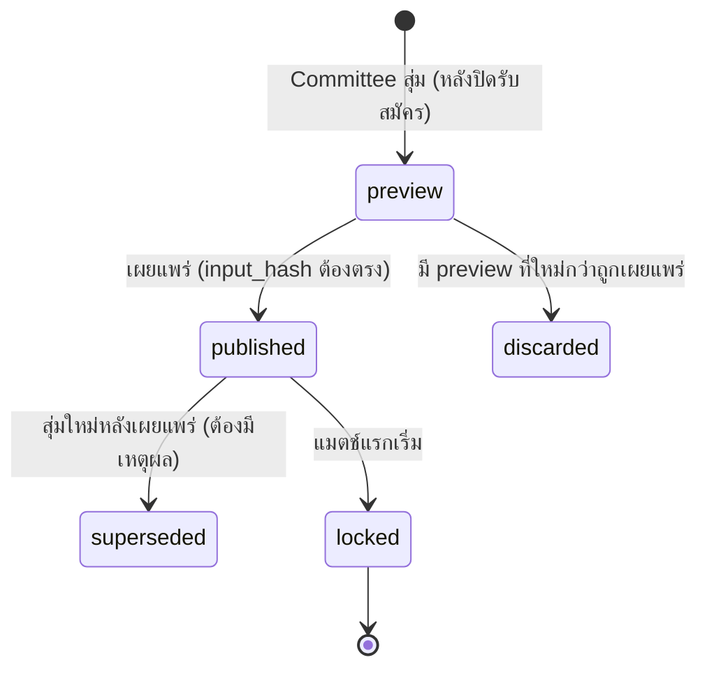

# สเปกระบบจับสายอัตโนมัติ (bl-04)

> สถานะ: **v1 — เจ้าของอนุมัติแล้ว 2026-10-07 (D1–D8 ตามข้อเสนอ)** · ตรึงแล้ว — แก้ได้เฉพาะถ้อยคำ/ชี้แจง; เปลี่ยนกติกาต้องผ่าน god → เจ้าของ · ส่วนขยายรอบแบ่งกลุ่มอยู่ใน [`tournament-format.md`](tournament-format.md)
> ผู้เขียน: Jim (Lead Dev) · 2026-10-07 · สัญญา API: [`../api/openapi.yaml`](../api/openapi.yaml) (tag `draws`: `Draw`, `Bracket`)
> ใช้เกรดทางการ (`center`/`score` ที่อนุมัติแล้ว) จาก [`grading.md`](grading.md)

## 1. สรุปใน 1 นาที

1. ใช้กับการแข่ง **แพ้คัดออก (single elimination)** ทีละประเภท (event) เช่น ชายเดี่ยว เกรด S-–S+
2. ขนาดสาย = กำลังสองที่ ≥ จำนวนผู้สมัคร ส่วนที่ขาดเป็น **bye** (ผ่านรอบแรกฟรี) และ bye ตกกับมือวางอันดับสูงก่อน
3. **มือวาง (seed)** เรียงจากคะแนนเกรดที่อนุมัติแล้ว วางตำแหน่งตามแบบมาตรฐานให้มือวางอันดับต้นไม่เจอกันเร็ว
4. คนที่เหลือสุ่มลงช่อง โดย **กฎเหล็ก: คนทีมเดียวกันห้ามเจอกันรอบแรก** — ถ้าทำไม่ได้จริง (ทีมเดียวมีคนเกินครึ่งสาย) ระบบหาแบบที่ชนกันน้อยที่สุด และคณะกรรมการต้องกดยอมรับก่อนเผยแพร่
5. การสุ่มใช้ **seed ที่บันทึกไว้** — ข้อมูลเดิม + seed เดิม = สายเดิมทุกครั้ง ตรวจซ้ำได้ (ปุ่ม verify)
6. ทุกการสุ่ม/เผยแพร่/สุ่มใหม่ ลง **audit log** พร้อมเหตุผล — กันการ "สุ่มจนกว่าจะได้สายที่ชอบ"

## 2. ข้อมูลเข้า (snapshot ณ ตอนสุ่ม)

| ข้อมูล | ที่มา | หมายเหตุ |
|---|---|---|
| รายชื่อ entry ที่ `active` | ปิดรับสมัครแล้วเท่านั้น | เดี่ยว = 1 คน · คู่ = 2 คน |
| ทีมของผู้เล่น | `team_memberships` ที่มีผล **ณ วันสุ่ม** | ผู้เล่นไม่มีทีม = ไม่ชนกับใคร |
| ทีมของ entry | เดี่ยว: ทีมของผู้เล่น · คู่: **ชุดทีมของทั้งสองคน** (อาจมี 1 หรือ 2 ทีม) | สอง entry "ทีมเดียวกัน" ⟺ ชุดทีมมีตัวซ้ำกันอย่างน้อย 1 ทีม |
| `seedScore` | เดี่ยว: `score` ที่อนุมัติ · คู่: ค่าเฉลี่ย `score` ของสองคน (decision D2) | ผู้ไม่มีเกรดอนุมัติสมัครไม่ได้ตั้งแต่แรก (`NO_APPROVED_GRADE`) |
| `seed` (ค่าสุ่ม) | เซิร์ฟเวอร์สร้างจาก CSPRNG 128 บิต **หรือ** คณะกรรมการใส่เอง (เช่น สุ่มสดหน้างาน) | เก็บถาวร |
| `ruleset_version` | ค่าคงที่ในโค้ด เช่น `draw-v1` | เปลี่ยนกติกา = เวอร์ชันใหม่ |

`input_hash` = SHA-256 ของ snapshot ที่เรียงตาม entry id (id, ชุดทีม, seedScore) + จำนวนมือวาง + ruleset_version — ใช้ยืนยันว่าข้อมูลไม่เปลี่ยนระหว่าง preview กับ publish

## 3. ขนาดสาย มือวาง และ bye

| จำนวน entry (N) | ขนาดสาย (S) | จำนวนมือวางเริ่มต้น |
|---|---|---|
| 2 | 2 | 0 |
| 3–4 | 4 | 2 |
| 5–8 | 8 | 2 |
| 9–16 | 16 | 4 |
| 17–32 | 32 | 8 |
| 33–64 | 64 | 16 |
| 65–256 | 128–256 | 16 (decision D1) |

**ลำดับช่องมาตรฐาน (balanced bracket):** ทุกช่องในสายมี "อันดับเสมือน" 1..S จัดแบบที่อันดับ r เจอกับ S+1−r ในรอบแรก และอันดับ 1–2 อยู่คนละครึ่ง, 1–4 อยู่คนละ quarter, 1–8 อยู่คนละ eighth (ตัวอย่าง S = 8: ช่อง 1–8 มีอันดับเสมือน `1, 8, 4, 5, 2, 7, 3, 6`; สูตรใน ภาคผนวก ก)

| ขั้น | กติกา |
|---|---|
| เรียงมือวาง | เรียง entry ตาม `seedScore` มากไปน้อย; คะแนนเท่ากันตัดสินด้วย PRNG |
| วางมือวาง | มือวาง 1 → ช่องอันดับเสมือน 1 · มือวาง 2 → อันดับ 2 · กลุ่ม 3–4 → ช่องอันดับ 3–4 **สุ่มว่าใครได้ช่องไหน** · กลุ่ม 5–8 → อันดับ 5–8 สุ่มภายในกลุ่ม · กลุ่ม 9–16 เช่นกัน |
| วาง bye | จำนวน bye = S − N วางในช่องที่อันดับเสมือน N+1..S → bye จะเจอกับอันดับ 1..(S−N) อัตโนมัติ = **มือวางอันดับสูงได้ bye ก่อน** และ bye กระจายทั่วสาย |
| ช่องที่เหลือ | สำหรับผู้ไม่ได้เป็นมือวาง → ตัวแก้เงื่อนไข (§4) |

## 4. ตัวแก้เงื่อนไข "ทีมเดียวกันห้ามเจอกันรอบแรก"

**เป้าหมาย (เรียงความสำคัญ):**

1. **กฎเหล็ก:** จำนวนคู่รอบแรกที่เป็นทีมเดียวกัน = 0 (ถ้าเป็นไปได้)
2. ถ้าเป็นไปไม่ได้ → ให้น้อยที่สุด และ **ไม่ให้เกี่ยวกับมือวาง** ถ้าเลี่ยงได้
3. (ถ้าเจ้าของเลือก D4) แยกคนทีมเดียวกันไปคนละครึ่ง/คนละ quarter ให้มากที่สุด — เป็นเป้ารอง ไม่บังคับ
4. นอกจากเงื่อนไขข้างบน ทุกการจัดวางมีโอกาสเท่ากัน (สุ่มจริง ไม่เอนเอียง)

**วิธี (อธิบายสำหรับเจ้าของ — Kevin ทำเป็นฟังก์ชัน pure ใน `packages/shared`):**

| ขั้น | ทำอะไร |
|---|---|
| 1. ตรวจความเป็นไปได้ | ทีมที่มี entry มากที่สุด t คน ถ้า **t > S/2** → เลี่ยงไม่ได้แน่ (ช่องรอบแรกมี S/2 คู่ แต่ละคู่รับคนทีมนี้ได้คนเดียว) — ขั้นต่ำที่ต้องชน = t − S/2 คู่ (กรณีประเภทเดี่ยว) |
| 2. สับลำดับ | เรียง entry ที่ไม่ใช่มือวางตาม id แล้วสับด้วย PRNG (Fisher–Yates) |
| 3. วางทีละช่องแบบย้อนรอย (backtracking) | เลือกช่องว่างที่มีตัวเลือกน้อยที่สุดก่อน · ลอง entry ตามลำดับที่สับไว้ · ข้าม entry ที่ทีมชนกับคู่รอบแรกในช่องตรงข้าม · ทางตันให้ย้อนกลับ |
| 4. ขีดจำกัด | ค้นได้สูงสุด 200,000 ขั้น (ค่าตั้งใน ruleset · เป้าเวลา < 1 วินาทีสำหรับสาย 256) — ถ้าหมด ใช้แบบที่ชนน้อยสุดที่เจอ และบันทึกว่า "ยังไม่พิสูจน์ว่าน้อยสุด" |
| 5. ผลลัพธ์ | ช่องทั้งหมด + รายการคู่ที่ชน (`conflicts`) + `minimumPossibleConflicts` + สถิติการค้น |

- กรณีปกติ (ไม่มีทีมไหนเกินครึ่งสาย) **ประเภทเดี่ยวหาทางที่ไม่ชนได้เสมอ** · ประเภทคู่ที่คู่มาจากสองทีม ซับซ้อนกว่าแต่ในทางปฏิบัติหาเจอเกือบทุกครั้ง — ถ้าไม่เจอจะเข้า fallback
- PRNG ต้องเป็นอัลกอริทึมที่ระบุชื่อและเวอร์ชันไว้ใน ruleset (เช่น xoshiro128** ตั้งต้นจาก seed) — **ห้ามใช้ตัวสุ่มของระบบ** เพราะจะตรวจซ้ำไม่ได้
- ทุกการวนลูปต้องมีลำดับตายตัว (เรียงตาม id) เพื่อให้ผลเหมือนเดิมทุกเครื่อง

## 5. เมื่อเลี่ยงไม่ได้ (fallback)

| สถานการณ์ | สิ่งที่ระบบทำ |
|---|---|
| ชนขั้นต่ำ > 0 | สร้างสายที่ชน **น้อยที่สุด** โดยให้คู่ที่ชนเป็นผู้ไม่ได้เป็นมือวางและ `seedScore` ต่ำที่สุดก่อน |
| แสดงผล | หน้า preview แสดงแถบเตือนสีแดง: ชนกี่คู่ คู่ไหน และ "นี่คือค่าน้อยสุดที่เป็นไปได้" (หรือ "ดีที่สุดที่หาเจอ") |
| เผยแพร่ | ต้องติ๊ก `acknowledgeConflicts` — ไม่งั้น API ตอบ `DRAW_CONFLICTS_NOT_ACKNOWLEDGED` · การยอมรับลง audit |

ตัวอย่างที่เลี่ยงไม่ได้: 4 entry มาจากทีม A 3 คน → S = 4 มีคู่รอบแรก 2 คู่ → ทีม A ต้องเจอกันเองอย่างน้อย 1 คู่

## 6. วงจรชีวิตของสาย (draw versions)

- 1 event มีสายที่ `published` ได้ครั้งละ 1 เวอร์ชัน; ทุกเวอร์ชันเก็บถาวร (ไม่ลบ)
- ถ้าข้อมูลผู้สมัครเปลี่ยนหลัง preview → `input_hash` ไม่ตรง → publish ไม่ได้ (`DRAW_INPUT_CHANGED`) ต้อง preview ใหม่

## 7. นโยบายสุ่มใหม่ (re-draw)

| เมื่อไร | กติกาที่เสนอ |
|---|---|
| ก่อนเผยแพร่ | preview แรกหลังปิดรับสมัครคือสายที่ **ควร** เผยแพร่ · สุ่ม preview ใหม่ด้วยข้อมูลเดิมได้ แต่ **ต้องใส่เหตุผล** และทุก preview แสดงใน audit (decision D5) |
| หลังเผยแพร่ ก่อนแข่ง | สุ่มใหม่ได้เฉพาะ Committee + เหตุผล (เช่น ข้อมูลทีมผิด) → เวอร์ชันใหม่ เวอร์ชันเดิม `superseded` · หน้าสาธารณะแสดง "สายเวอร์ชัน 2 — เหตุผล: …" |
| ถอนตัวหลังเผยแพร่ | **ไม่สุ่มใหม่** — ถ้ามีตัวสำรอง ตัวสำรองลงช่องเดิม; ไม่มี → คู่แข่งได้ชนะผ่าน (walkover) |
| หลังแมตช์แรกเริ่ม | ล็อก — สุ่มใหม่ไม่ได้ |

## 8. Audit log (ทุกเหตุการณ์ append-only)

| action | ข้อมูลที่บันทึก |
|---|---|
| `draw.preview` | ผู้กด, เวลา, seed, ที่มาของ seed (server/committee), input_hash, ruleset_version, snapshot entry, ช่องทั้งหมด, conflicts, minimum, สถิติการค้น, เหตุผล (ถ้าไม่ใช่ preview แรก) |
| `draw.publish` | ผู้กด, draw id/version, acknowledgeConflicts |
| `draw.supersede` | ผู้กด, เวอร์ชันเก่า→ใหม่, เหตุผล |
| `draw.verify` | ผู้กด, ผลตรวจซ้ำ (ตรง/ไม่ตรง) |
| `entry.withdraw` | ผู้กด, entry, ช่อง, การจัดการ (ตัวสำรอง/walkover) |

ปุ่ม **verify**: รันตัวจับสายใหม่จาก snapshot + seed ที่เก็บไว้ แล้วเทียบช่องทุกช่อง — ต้อง "ตรงกัน 100%"

## 9. ข้อสันนิษฐาน

1. รูปแบบแข่งเฟสแรก = แพ้คัดออกอย่างเดียว (ไม่มีรอบแบ่งกลุ่ม/round robin/ชิงที่ 3)
2. "ทีม" = สโมสร/สังกัดใน `teams` ไม่ใช่จังหวัด/โรงเรียน (ถ้าต้องการหลายมิติ แจ้งได้)
3. ประเภทคู่ใช้ค่าเฉลี่ยคะแนนสองคนเป็น seedScore
4. ไม่มี wildcard/qualifier ในเฟสแรก

## 10. คำถามเปิด

1. ต้องการ "สุ่มสดหน้างาน" (คณะกรรมการใส่ seed ต่อหน้าผู้เข้าแข่ง) หรือไม่
2. ต้องการระบบตัวสำรอง (reserve list) หรือถอนตัว = walkover อย่างเดียว
3. รอบแบ่งกลุ่ม (round robin) ต้องมีในเฟสไหน — ถ้ามี กฎทีมเดียวกันใช้กับการแบ่งกลุ่มด้วยหรือไม่

## 11. ตารางการตัดสินใจสำหรับเจ้าของ

| # | เรื่อง | ตัวเลือก | ข้อเสนอของ Jim | ถ้าเลือกอย่างอื่น |
|---|---|---|---|---|
| D1 | จำนวนมือวาง | (ก) **ตามตาราง §3 (S/4 สูงสุด 16)** (ข) ไม่มีมือวาง สุ่มล้วน (ค) คณะกรรมการกำหนดเองทุกรายการ | **(ก)** | (ข) มือดีอาจเจอกันรอบแรก ไม่ยุติธรรมต่อผู้ชม/ผู้เล่น · (ค) เพิ่มช่องกรอกและความเสี่ยงอคติ |
| D2 | คะแนนมือวางประเภทคู่ | (ก) **ค่าเฉลี่ย score สองคน** (ข) คนที่เก่งกว่า (ค) ผลรวม | **(ก)** | ต่างกันเฉพาะลำดับมือวางคู่ — สูตรอื่นไม่เปลี่ยน |
| D3 | เมื่อเลี่ยงทีมชนไม่ได้ (Dwight Q3) | (ก) **สายที่ชนน้อยสุด + คณะกรรมการกดยอมรับ** (ข) ระงับการสุ่มจนกว่าจะแก้รายชื่อ (ค) ขยายขนาดสาย (bye เพิ่ม) | **(ก)** | (ข) อาจทำให้จัดแข่งไม่ได้ · (ค) ไม่ช่วยเมื่อทีมเดียวมีคนเกินครึ่ง และทำให้สายใหญ่เกินจำเป็น |
| D4 | แยกทีมเดียวกันรอบหลัง | (ก) บังคับเฉพาะรอบแรก (ข) **รอบแรกบังคับ + พยายามแยกคนละครึ่งสายเป็นเป้ารอง** (ค) บังคับคนละ quarter | **(ข)** | (ก) ง่ายสุดแต่คนทีมเดียวกันอาจเจอกันรอบสอง · (ค) เป็นไปไม่ได้บ่อยเมื่อทีมใหญ่ ต้องมี fallback ซ้อนอีกชั้น |
| D5 | กัน "สุ่มจนกว่าจะชอบ" | (ก) **preview แรกคือสายหลัก สุ่มใหม่ต้องมีเหตุผล + ทุก preview อยู่ใน audit** (ข) preview ได้ไม่จำกัด (ค) ต้องสุ่มสดด้วย seed สาธารณะเท่านั้น | **(ก)** | (ข) เสี่ยงข้อครหาเรื่องความยุติธรรม · (ค) โปร่งใสสุดแต่ต้องมีพิธีหน้างานทุกครั้ง |
| D6 | ถอนตัวหลังเผยแพร่ | (ก) **ตัวสำรองลงช่องเดิม ไม่มีก็ walkover** (ข) walkover เสมอ (ค) สุ่มใหม่ | **(ก)** | (ค) ทำให้สายที่ประกาศแล้วเปลี่ยน ผู้เล่นคนอื่นเสียประโยชน์ |
| D8 | ใครสุ่มใหม่ได้ และหลังมีผลแข่งได้ไหม (Dwight Q6) | (ก) **Committee เท่านั้น + เหตุผล; ห้ามเด็ดขาดหลังแมตช์แรกเริ่ม (locked)** (ข) Admin ก็ได้ (ค) อนุญาตหลังมีผลถ้า Committee ≥ 2 คนยืนยัน | **(ก)** | (ค) ต้องนิยามว่าผลแมตช์ที่แข่งไปแล้วเป็นอย่างไร — ไม่แนะนำ |
| D7 | ทีมของคู่ผสมสโมสร (= S9 ของ Kevin) | (ก) **ชนถ้ามีทีมซ้ำอย่างน้อย 1 ทีม** (ข) ชนเฉพาะเมื่อทั้งคู่มาจากทีมเดียวกันหมด | **(ก)** | (ข) เงื่อนไขหลวมขึ้น หาสายง่ายขึ้น แต่คนสโมสรเดียวกันอาจเจอกันรอบแรก |

> **สิ่งที่เจ้าของต้องตอบ:** อนุมัติ D1–D8 (สำคัญที่สุด: D3 เมื่อเลี่ยงไม่ได้, D4 แยกรอบหลัง, D5 กันสุ่มซ้ำ) + คำถามเปิด §10

---

## ภาคผนวก ก — การสร้างลำดับช่องมาตรฐาน (pseudo-formula)

- เริ่ม `L = [1, 2]`
- ทำซ้ำจนความยาว = S: สร้าง `L'` โดยแทนแต่ละค่า `r` ใน L ด้วยคู่ `[r, (2·|L|) + 1 − r]` ตามลำดับ
- ตัวอย่าง: `[1,2]` → `[1,4,2,3]` → `[1,8,4,5,2,7,3,6]` (S = 8) → S = 16: `[1,16,8,9,4,13,5,12,2,15,7,10,3,14,6,11]`
- ruleset `draw-v1` ใช้ลำดับจากสูตรนี้ตรงตัว · Kevin ต้องเขียนเทสต์ยืนยันคุณสมบัติ: (1) r เจอ S+1−r ในรอบแรก (2) อันดับ 1 และ 2 อยู่คนละครึ่ง (3) อันดับ 1–4 อยู่คนละ quarter, 1–8 คนละ eighth (4) อันดับ 1 อยู่ช่อง 1

## ภาคผนวก ข — ตัวอย่างครบวง (test fixture)

> **ชี้แจงวิธีทดสอบ:** ส่วนที่ตายตัวตรวจได้ตรงตัว (มือวาง, ตำแหน่ง bye, ช่อง 1/2/5/6) · การวางผู้ไม่ได้เป็นมือวางขึ้นกับ PRNG จึง **ไม่สัญญาว่าตรงกับตัวอย่างทุกช่อง** — เทสต์ตรวจ (1) คุณสมบัติ: ไม่มีคู่ทีมเดียวกันในรอบแรกเมื่อเป็นไปได้, ทุก entry ลงช่องเดียว, bye อยู่ตรงอันดับเสมือน N+1..S (2) **golden snapshot** 1 ชุดต่อ seed string ที่ตรึงไว้ตอน merge (ผลเดิมทุกครั้ง)

ประเภทชายเดี่ยว N = 6: A1 (8.2), B1 (8.0), A2 (7.6), C1 (7.4), A3 (7.1), B2 (6.9) — ตัวอักษร = ทีม

- S = 8, มือวาง 2 คน: มือวาง 1 = A1, มือวาง 2 = B1 · bye = 2 → ช่องอันดับเสมือน 7, 8
- ลำดับช่อง (draw-v1): ช่อง 1..8 = อันดับ `1, 8, 4, 5, 2, 7, 3, 6`
- ช่อง 1 = A1 (อันดับ 1) · ช่อง 2 = bye (อันดับ 8) · ช่อง 5 = B1 (อันดับ 2) · ช่อง 6 = bye (อันดับ 7)
- ช่องว่าง 3, 4, 7, 8 → คู่รอบแรก (3 v 4), (7 v 8) · ทีม A เหลือ 2 คน (A2, A3) ต้องอยู่คนละคู่
- ตัวอย่างผลหนึ่งที่ถูกต้อง (ผลจริงขึ้นกับ seed): ช่อง 3 = A2, 4 = C1, 7 = B2, 8 = A3 → ไม่มีคู่ทีมเดียวกัน · conflicts = 0
- ตัวอย่างผลที่ **ผิด** (ต้องไม่เกิด): ช่อง 3 = A2, 4 = A3

ตัวอย่างเลี่ยงไม่ได้: N = 4: A1, A2, A3, B1 → S = 4, S/2 = 2, ทีม A มี 3 > 2 → `minimumPossibleConflicts = 1` → publish ต้อง `acknowledgeConflicts = true`
