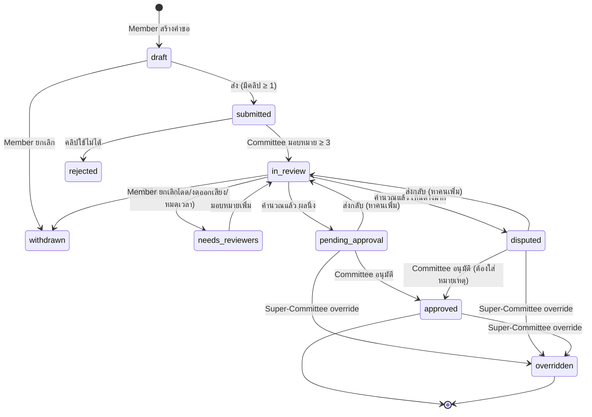

# สเปกระบบประเมินมือแบบหลายกรรมการ + สถิติความสอดคล้อง (bl-03)

> สถานะ: **ร่าง — รอเจ้าของอนุมัติสมการ** `[WAITING FOR OWNER APPROVAL]` · ห้ามสร้างงานให้ Dev จนกว่าเจ้าของอนุมัติ
> ผู้เขียน: Jim (Lead Dev) · 2026-10-07 · สัญญา API: [`../api/openapi.yaml`](../api/openapi.yaml) (`GradeView`, `AssessmentResult`, `RaterStats`)
> รูปแบบผลลัพธ์ยืมจาก bad8bit (`GradeProjection`: low/high/center/kind/txt + บันได 15 ขั้น) — **ยืมเฉพาะรูปแบบ** สมการทั้งหมดในเอกสารนี้เป็นของ blulens

## 1. สรุปใน 1 นาที

1. นักกีฬาส่งคลิป → คณะกรรมการมอบหมายกรรมการ **อย่างน้อย 3 คน** ให้คะแนนแบบไม่เห็นกัน (blind)
2. กรรมการให้คะแนน **6 หัวข้อ** โดยเลือกขั้นบนบันได 15 ขั้น (RK1…P+) ต่อหัวข้อ
3. ระบบเฉลี่ยถ่วงน้ำหนักเป็นคะแนนรายกรรมการ → **ตัดคะแนนโดด** (ไกลจากค่ากลางเกิน 2 ขั้น และโดดทางสถิติ) → เฉลี่ยส่วนที่เหลือเป็น `score`
4. ความไม่แน่นอนจากความเห็นที่ต่างกัน → `margin` → ได้ **`lower` / `upper`** (ขั้นล่าง/บน) และป้าย เช่น `S`, `S/S+`, `S-–N-`
5. ผลที่กรรมการเห็นต่างกันมาก → สถานะ `disputed` ให้คณะกรรมการตัดสิน · ผลปกติ → รออนุมัติ · Super-Committee **override** ได้โดยต้องให้เหตุผล
6. **Kappa ใช้วัด "กรรมการ" ไม่ใช่ "ผู้เล่น"** — Cohen (ถ่วงน้ำหนักกำลังสอง) วัดรายคน/รายคู่, Fleiss วัดทั้งคณะ → ใช้จับกรรมการที่ให้คะแนนเพี้ยน ไม่ได้ไปแก้คะแนนผู้เล่นโดยอัตโนมัติ (decision G5)

## 2. บันไดเกรดและสเกลคะแนน

บันได 15 ขั้น (ลอกจาก bad8bit ตรงตัว · ขีดกลางเป็น ASCII `-`):

| ดัชนี | 0 | 1 | 2 | 3 | 4 | 5 | 6 | 7 | 8 | 9 | 10 | 11 | 12 | 13 | 14 |
|---|---|---|---|---|---|---|---|---|---|---|---|---|---|---|---|
| เกรด | RK1 | RK2 | RK3 | BG1 | BG2 | BG3 | S- | S | S+ | N- | N | N+ | P- | P | P+ |
| Tier | Rookie | | | Beginner | | | Standard | | | Neutral | | | Professional | | |

- **`score` เป็นทศนิยมในหน่วย "ขั้น" ช่วง 0.00–14.99** — ส่วนจำนวนเต็มคือดัชนีขั้น เช่น `7.80` = อยู่ในขั้น `S` ค่อนไปทาง `S+`
- เมื่อกรรมการเลือกขั้นดัชนี `i` ให้หัวข้อหนึ่ง ระบบแปลงเป็นค่า **`i + 0.5`** (กึ่งกลางขั้น) — ถ้ากรรมการทุกคนเลือก `S` ตรงกัน คะแนนจะอยู่กลางขั้น `S` พอดี ไม่ใช่ที่ขอบ
- หน้าเว็บจะแสดง score อย่างไร (เช่น 7.8 หรือแถบตำแหน่ง) เป็นงานของ Pam — สัญญา API ส่งค่าดิบ

## 3. Rubric (ร่าง — เจ้าของปรับได้ใน decision G1)

| # | key | หัวข้อ | น้ำหนักเริ่มต้น |
|---|---|---|---|
| 1 | `footwork` | การเคลื่อนที่/ฟุตเวิร์ก | 1 |
| 2 | `overhead` | ลูกเหนือศีรษะ (เคลียร์ ดรอป ตบ) | 1 |
| 3 | `net` | หน้าตาข่าย (หยอด ตัด งัด) | 1 |
| 4 | `defense` | การรับ/ป้องกัน | 1 |
| 5 | `tactics` | การอ่านเกม/แท็กติก | 1 |
| 6 | `consistency` | ความสม่ำเสมอ/การควบคุมลูก | 1 |

- แต่ละหัวข้อมีคำอธิบายหลักยึด (anchor) ราย Tier (ภาคผนวก ก) ให้กรรมการเทียบ
- หัวข้อที่ดูจากคลิปไม่ได้ กรรมการเลือก **"ประเมินไม่ได้"** ได้ — หัวข้อนั้นไม่ถูกนับสำหรับกรรมการคนนั้น (น้ำหนักที่เหลือปรับสัดส่วนใหม่)
- ถ้าหัวข้อที่ "ประเมินไม่ได้" รวมน้ำหนักเกินครึ่ง → รีวิวนั้นถือเป็น **งดออกเสียง** ไม่นำมาคิด และต้องหากรรมการเพิ่ม

## 4. ขั้นตอนคำนวณ (ภาพรวม — สูตรเต็มในภาคผนวก ข)

| ขั้น | ทำอะไร | ค่าเริ่มต้นที่เสนอ |
|---|---|---|
| 1. คะแนนรายกรรมการ | `v_j` = ค่าเฉลี่ยถ่วงน้ำหนักของหัวข้อที่ประเมินได้ | น้ำหนักเท่ากัน |
| 2. ตรวจคะแนนโดด | โดด ถ้า **ห่างจากมัธยฐานเกิน 2.0 ขั้น** และ (คนอื่นเห็นตรงกันหมด **หรือ** modified z-score เกิน 3.5) | ตัดได้สูงสุด 1 คน (หรือ ⌊n/4⌋ ถ้า n ≥ 8) |
| 3. พอหรือยัง | ถ้าเหลือรีวิวที่ใช้ได้ < 3 → สถานะ `needs_reviewers` (หาคนเพิ่ม) ไม่สรุปผล | ขั้นต่ำ 3 คน |
| 4. `score` | ค่าเฉลี่ยของ `v_j` ที่เหลือ | mean |
| 5. `margin` | ช่วงความเชื่อมั่น 80% ของค่าเฉลี่ย: `t × SD / √n` แต่ไม่ต่ำกว่า 0.25 ขั้น และไม่เกิน 3.0 ขั้น | 80%, ขั้นต่ำ 0.25 |
| 6. ฉายลงบันได | `lower` = ขั้นของ `score − margin` · `upper` = ขั้นสุดท้ายที่ช่วง `[score − margin, score + margin)` แตะ · `center` = ขั้นของ `score` | ช่วงครึ่งเปิด |
| 7. จัดประเภท | ห่าง 0 ขั้น = `exact` · 1 ขั้น = `straddle` · ≥ 2 ขั้น = `wide` | เหมือน bad8bit |
| 8. ตัดสินสถานะ | `disputed` ถ้า spread (สูงสุด−ต่ำสุดของที่เหลือ) > 3.0 ขั้น **หรือ** margin > 1.5 ขั้น · ไม่งั้น `pending_approval` | — |

### ค่าพารามิเตอร์ (ค่าจริงสำหรับตัวแปรใน test plan ของ Dwight)

| ตัวแปร (test-plan) | ค่า | ขอบเขต |
|---|---|---|
| `N_min` | 3 รีวิวที่ใช้ได้ | ใช้ได้ = ส่งแล้ว ไม่งดออกเสียง ไม่ถูกตัดเป็นโดด · รีวิวร่าง/ยังไม่ส่ง **ไม่นับ** |
| `K_out` | ห่างมัธยฐาน **> 2.0** ขั้น (มากกว่าอย่างเคร่งครัด — ห่าง 2.0 พอดี **ไม่**โดด) และ (MAD = 0 หรือ \|modified z\| **> 3.5**) | ตัดสูงสุด 1 (n < 8) / ⌊n/4⌋ (n ≥ 8) |
| `T_wait` | 72 ชม. นับจากเวลามอบหมาย | เตือนที่ 48 ชม. · ครบ 72 ชม. → `expired` + มอบหมายแทน |
| เกณฑ์ disputed | spread **> 3.0** ขั้น หรือ margin **> 1.5** ขั้น | — |
| margin | ขั้นต่ำ 0.25 · สูงสุด 3.0 | — |
| แบ่ง 2 ขั้ว (เช่น 2/2) | MAD เท่ากับระยะทุกคน → z = 0.67 → **ไม่ตัดใคร** → มักเข้า disputed | ไม่เลือกข้าง |

### ตัวอย่าง (ละเอียดในภาคผนวก ค)

| กรณี | คะแนนรายกรรมการ `v_j` | ตัดออก | score | margin | lower–upper | ป้าย | สถานะ |
|---|---|---|---|---|---|---|---|
| เห็นตรงกัน | 7.50, 7.50, 7.83 | – | 7.61 | 0.25 | S–S | `S` (exact) | pending_approval |
| เห็นต่างเล็กน้อย | 7.50, 7.50, 8.50 | – | 7.83 | 0.63 | S–S+ | `S/S+` (straddle) | pending_approval |
| มีคนโดด | 7.50, 7.83, 8.17, **11.00** | 11.00 | 7.83 | 0.36 | S–S+ | `S/S+` | pending_approval (+ธง OUTLIER_EXCLUDED) |
| เห็นต่างมาก | 6.50, 7.50, 9.50 | – | 7.83 | 1.66 | S-–N- | `S-–N-` (wide) | **disputed** |
| 3 คน โดด 1 | 7.50, 7.50, 11.50 | 11.50 | – | – | – | – | **needs_reviewers** (เหลือ 2 < 3) |

## 5. สถิติความสอดคล้องของกรรมการ (Kappa)

> **ข้อเท็จจริงที่เจ้าของควรรู้:** Kappa เป็นสถิติของ "กลุ่มเคสจำนวนมาก" — คำนวณกับผู้เล่นคนเดียวไม่ได้ จึงใช้ Kappa เพื่อ **ติดตามคุณภาพกรรมการตามช่วงเวลา** ส่วนความไม่แน่นอนของผู้เล่นแต่ละคนสะท้อนผ่าน `margin` แล้ว

| ตัวชี้วัด | สูตร | ข้อมูลที่ใช้ | แสดงเมื่อ | ใช้ทำอะไร |
|---|---|---|---|---|
| **Kappa รายกรรมการ vs ฉันทามติ** | Cohen's Kappa ถ่วงน้ำหนักกำลังสอง (quadratic weighted) บน 15 ขั้น | ขั้นที่กรรมการคนนั้นให้ เทียบกับขั้นของค่าเฉลี่ย **คนอื่น** ในเคสเดียวกัน (leave-one-out) | ≥ 15 รีวิวในช่วงเวลา | ตัวชี้วัดหลักรายคน |
| **Kappa รายคู่** | Cohen's Kappa ถ่วงน้ำหนักกำลังสอง | เคสที่ทั้งสองคนให้คะแนนร่วมกัน | ≥ 10 เคสร่วม | ดูคู่ที่ขัดกันประจำ |
| **Kappa ทั้งคณะ** | Fleiss' Kappa บน **5 Tier** (รองรับจำนวนกรรมการต่อเคสไม่เท่ากัน) | ทุกเคสที่มีรีวิว ≥ 2 | ≥ 20 เคส | ตัวเลขหัวแดชบอร์ด "คณะกรรมการเห็นตรงกันแค่ไหน" |
| **Bias รายกรรมการ** | ค่าเฉลี่ยของ (คะแนนตัวเอง − ค่าเฉลี่ยคนอื่น) หน่วยขั้น | เช่นเดียวกับข้างบน | ≥ 15 รีวิว | ใครให้สูง/ต่ำกว่าคนอื่นประจำ |
| **อัตราถูกตัดเป็นโดด** | จำนวนครั้งที่ถูกตัด ÷ จำนวนรีวิว | — | ≥ 15 รีวิว | — |

- ทำไม Fleiss ใช้ Tier ไม่ใช่ 15 ขั้น: Fleiss ถือทุกหมวดเท่ากัน (ไม่รู้ว่า S กับ S+ ใกล้กว่า S กับ P) — กับ 15 ขั้นจะได้ค่าต่ำเกินจริง 5 Tier หยาบพอให้ความหมายตรง
- ทำไม Cohen ใช้ถ่วงน้ำหนักกำลังสอง: คะแนนเป็นลำดับ ผิด 1 ขั้นควรโดนลงโทษน้อยกว่าผิด 5 ขั้นมาก
- ระดับการแปลผล (Landis & Koch): < 0.21 แย่ · 0.21–0.40 พอใช้ · 0.41–0.60 ปานกลาง · 0.61–0.80 ดี · > 0.80 ดีมาก
- **ธงกรรมการ** (เมื่อมี ≥ 15 รีวิว): Kappa vs ฉันทามติ < 0.40 **หรือ** |bias| > 1.0 ขั้น **หรือ** ถูกตัดเป็นโดด > 20% → แจ้งคณะกรรมการ (ให้ทำชุดคลิปปรับมาตรฐาน / หยุดมอบหมายชั่วคราว — คนตัดสินคือคณะกรรมการ ไม่ใช่ระบบ)
- คำนวณใหม่ทุกคืน + กดคำนวณเองได้ เก็บเป็น snapshot พร้อม `method_version`
- รีวิวที่ถูกตัดเป็นโดด **ยังนับ** ในสถิติกรรมการ (มันคือสิ่งที่เราต้องการวัด)
- **Kappa ไม่นิยาม** (ตัวหารเป็น 0 — เช่น ทุกคนให้หมวดเดียวกันทุกเคส จนความสอดคล้องโดยบังเอิญ = 1): คืน `kappa: null`, band `insufficient` + ข้อความ "ข้อมูลไม่หลากหลายพอจะวัด" — **ไม่แสดงเป็น 1.0** (decision G12) · ไม่มีผลต่อการสรุปผลผู้เล่น เพราะ Kappa ไม่อยู่ในสูตรคะแนน

## 6. รูปแบบผลลัพธ์ (ตาม bad8bit) และการเก็บ

ทุกผลประเมิน (`GradeView` ใน openapi.yaml):

| ฟิลด์ | ความหมาย | เทียบ bad8bit |
|---|---|---|
| `score` | ทศนิยม 0–14.99 หน่วยขั้น | `bp` |
| `margin` | ครึ่งความกว้างช่วงความเชื่อมั่น (หน่วยขั้น) | `margin` |
| `lower` | grade key ขอบล่าง | `low` |
| `upper` | grade key ขอบบน | `high` |
| `center` | grade key ของ `score` ตรง ๆ — **ค่าที่ใช้เป็นเกรดทางการ** (จับสาย, เกณฑ์สมัครแข่ง) | `center` (→ `grade_key`) |
| `kind` | `exact` / `straddle` / `wide` | `kind` |
| `label` | `S` · `S/S+` · `S-–N-` (en dash สำหรับ wide) | `txt` |

- ตาราง `assessment_results` เป็น append-only: คำนวณใหม่หรือ override = แถวใหม่ (`version` +1) พร้อม `inputs` (คะแนนดิบ, ใครถูกตัด, z-score, พารามิเตอร์ทั้งหมด) และ `method_version` (เช่น `grading-v1`)
- **ต่างจาก bad8bit เรื่องเดียว (decision G9):** เสนอให้เก็บ `lower/upper/kind/label` เป็น snapshot ในแถวด้วย ไม่ฉายใหม่ตอนอ่าน — เอกสารของ bad8bit เองบันทึกว่าการฉายใหม่ทำให้ป้ายแถวเก่าเลื่อนเมื่อแก้ค่าตั้งค่า ระบบที่เน้นความยุติธรรมควรให้ผลที่อนุมัติแล้ว "นิ่ง"

## 7. การจัดการรีวิวไม่ครบ / มอบหมายกรรมการ

| สถานการณ์ | กติกาที่เสนอ |
|---|---|
| มอบหมาย | คณะกรรมการเลือกเอง หรือกด "สุ่มอัตโนมัติ" (สุ่มจากกรรมการที่ไม่ติด conflict และงานค้างน้อยสุด) · มอบหมาย 3 คน |
| Conflict of interest | ห้ามประเมินตัวเอง/คนทีมเดียวกัน ณ วันมอบหมาย — บังคับที่ API |
| Blind | กรรมการไม่เห็นคะแนนคนอื่นจนกว่าผลถูกอนุมัติ · ส่งแล้วแก้ไม่ได้ |
| กำหนดส่ง | 72 ชม. · เตือนที่ 48 ชม. · เลยกำหนด → assignment `expired` และมอบหมายแทนอัตโนมัติ 1 คน |
| กรรมการปฏิเสธ | กด decline พร้อมเหตุผล → มอบหมายแทน |
| งดออกเสียง | (ประเมินไม่ได้เกินครึ่งน้ำหนัก) → นับเป็นรีวิวที่ใช้ไม่ได้ → หาคนเพิ่ม |
| ค้างนาน | 14 วันยังไม่ครบ → แจ้งคณะกรรมการ |
| รีวิวเพิ่มหลังคำนวณแล้ว | คำนวณใหม่เป็นเวอร์ชันใหม่ (ถ้ายังไม่อนุมัติ) |
| กรรมการถูกถอด (เช่น พบ conflict ภายหลัง) | รีวิวของเขาถูกยกเลิก (ไม่ลบ — ติดธง) → คำนวณใหม่ · เหลือ < 3 → `needs_reviewers` · ถ้าผลอนุมัติไปแล้ว → Committee ต้องอนุมัติใหม่ · ลง audit |
| คลิปใช้ไม่ได้ | คณะกรรมการ `reject` พร้อมเหตุผล → ผู้เล่นยื่นใหม่ |

## 8. State machine ของคำขอประเมิน

**Super-Committee override:**

- ผู้ override ต้องถือ role Committee และ **ไม่ติด conflict** กับผู้เล่น
- ต้องระบุเหตุผล ≥ 20 ตัวอักษร · ระบุ `center` ใหม่ 1 ขั้น
- ผลใหม่: `score = ดัชนี + 0.5`, `margin = 0` → `lower = upper = center`, `kind = exact`, ธง `OVERRIDE` · ผลคำนวณเดิมยังอยู่ในประวัติ
- บันทึก audit + แจ้งเตือนคณะกรรมการทุกคน (decision G7 — เสนอทางเลือกให้ต้องมีผู้ยืนยันคนที่ 2)
- เกรดทางการของผู้เล่น = ผลล่าสุดที่สถานะ `approved` หรือ `overridden`

## 9. ข้อสันนิษฐาน

1. คลิป 1 คำขอแสดงการเล่นจริงพอให้ประเมินได้ทั้ง 6 หัวข้อ (ประมาณ 3–5 นาที)
2. มีกรรมการ active อย่างน้อย 6 คน (ให้มอบหมาย 3 คนโดยไม่ติด conflict ได้)
3. ปริมาณเคสพอให้ Kappa มีความหมาย (≥ 20 เคส/ไตรมาส) — ก่อนถึงจุดนั้นแดชบอร์ดแสดง "ข้อมูลไม่พอ"
4. การแข่งใช้ `center` เป็นเกรดทางการ ไม่ใช้ `lower`/`upper`

## 10. คำถามเปิด

1. rubric 6 หัวข้อนี้ตรงกับที่สมาคมใช้อยู่หรือไม่ — ถ้ามี rubric เดิม ขอเอกสาร
2. เกรดมีอายุหรือไม่ (เช่น 12 เดือนแล้วต้องประเมินใหม่ก่อนสมัครแข่ง)
3. ต้องการชุด "คลิปมาตรฐาน" ที่คณะกรรมการกำหนดเกรดไว้แล้ว เพื่อทดสอบ/ปรับมาตรฐานกรรมการใหม่หรือไม่

## 11. ตารางการตัดสินใจสำหรับเจ้าของ (สมการ — ต้องอนุมัติก่อนเริ่มงาน Dev)

| # | เรื่อง | ตัวเลือก | ข้อเสนอของ Jim | ถ้าเลือกอย่างอื่น |
|---|---|---|---|---|
| G1 | Rubric | (ก) 6 หัวข้อน้ำหนักเท่ากัน (ข) 6 หัวข้อน้ำหนักต่างกัน (ค) rubric ของสมาคม | **(ก)** · Committee แก้ได้ผ่านหน้า S12 → เป็น rubric เวอร์ชันใหม่ ใช้กับคำขอที่ส่งหลังจากนั้นเท่านั้น (= S5 ของ Kevin) | (ข)/(ค) แค่เปลี่ยนตารางน้ำหนัก/หัวข้อ สูตรไม่เปลี่ยน |
| G2 | สเกลให้คะแนนรายหัวข้อ | (ก) เลือกขั้นบนบันได 15 ขั้น (ข) 1–5 แล้วแปลงเป็นขั้น (ค) 0–100 | **(ก)** กรรมการคิดเป็นเกรดอยู่แล้ว ไม่ต้องมีตารางแปลง | (ข)/(ค) ต้องนิยามตารางแปลง → เพิ่มจุดให้เถียงกัน |
| G3 | จำนวนกรรมการขั้นต่ำ | (ก) 2 (ข) **3** (ค) 5 | **(ข) 3** — น้อยสุดที่ยังมีมัธยฐานและจับคนโดดได้ | (ก) จับโดดไม่ได้ ใช้ได้แค่ Cohen รายคู่ · (ค) แม่นขึ้นแต่ต้องมีกรรมการมากและช้า |
| G4 | การรวมคะแนน | (ก) **ค่าเฉลี่ยหลังตัดโดด** (ข) มัธยฐาน (ค) trimmed mean | **(ก)** | (ข) ทนคนโดดโดยไม่ต้องตัด แต่ใช้ข้อมูลน้อย score กระโดดเป็นขั้น ๆ เมื่อ n น้อย |
| G5 | Kappa มีผลต่อคะแนนผู้เล่นไหม | (ก) **ไม่ — ใช้ติดตามกรรมการเท่านั้น** (ข) ถ่วงน้ำหนักกรรมการตาม Kappa (ค) ขยาย margin เมื่อ Kappa คณะต่ำ | **(ก)** โปร่งใส อธิบายผู้เล่นได้ | (ข) คะแนนขึ้นกับประวัติกรรมการ อธิบายยาก และกรรมการใหม่ไม่มีค่า · (ค) ผลเก่า/ใหม่เทียบกันยาก |
| G6 | สถิติ Kappa | (ก) **Cohen ถ่วงน้ำหนักกำลังสอง (รายคน/รายคู่) + Fleiss บน 5 Tier (ทั้งคณะ)** (ข) Cohen ไม่ถ่วงน้ำหนัก + Fleiss บน 15 ขั้น (ค) Krippendorff's alpha (ordinal) แทนทั้งหมด | **(ก)** | (ข) ค่าต่ำเกินจริงเพราะไม่สนลำดับ · (ค) ถูกต้องทางสถิติที่สุดและรับข้อมูลขาดได้ แต่ไม่ใช่ "Kappa" ที่คุ้นเคย |
| G7 | Override | (ก) **Committee 1 คน + เหตุผล + แจ้งทุกคน** (ข) ต้องมี Committee คนที่ 2 ยืนยัน (four-eyes) | **(ก)** | (ข) ยุติธรรมกว่าแต่เพิ่มสถานะ `override_proposed` และหน้าอนุมัติ ≈ +2–3 วันงาน |
| G8 | เกณฑ์คะแนนโดด / เห็นต่างมาก | (ก) **โดด: ห่างมัธยฐาน > 2.0 ขั้น และ (MAD = 0 หรือ z > 3.5) · เห็นต่าง: spread > 3.0 หรือ margin > 1.5** (ข) กำหนดตัวเลขเอง | **(ก)** | เปลี่ยนแค่ค่าพารามิเตอร์ — สูตรเดิม |
| G9 | การเก็บ lower/upper | (ก) **เก็บ snapshot ในแถวผล** (ข) ฉายใหม่ตอนอ่านแบบ bad8bit | **(ก)** | (ข) ถ้าพารามิเตอร์เปลี่ยน ป้ายของผลที่อนุมัติไปแล้วจะเปลี่ยนตาม |
| G10 | Margin | (ก) **ช่วงเชื่อมั่น 80% ขั้นต่ำ 0.25 สูงสุด 3.0** (ข) 90% (ค) 68% (±1 SE) | **(ก)** | (ข) ช่วงกว้างขึ้น → ป้าย `straddle/wide` บ่อยขึ้น · (ค) ช่วงแคบ → `exact` บ่อยแต่มั่นใจเกินจริง |
| G12 | Kappa เมื่อทุกคนให้เหมือนกันหมด (Dwight Q1) | (ก) **"ไม่นิยาม" (null) + ข้อความอธิบาย** (ข) แสดง 1.0 | **(ก)** — ทางคณิตศาสตร์ไม่นิยาม และ 1.0 ทำให้ดูดีเกินจริงตอนข้อมูลน้อย · ผลผู้เล่นยังสรุปได้ตามปกติ | (ข) แดชบอร์ดอาจโชว์ "ดีมาก" ทั้งที่ยังวัดไม่ได้ |
| G13 | Conflict of interest (Dwight Q2) | (ก) **ห้ามกรรมการประเมินตัวเองและคนทีมเดียวกัน (บังคับที่ API)** (ข) อนุญาตแต่ติดธงให้ Committee เห็น | **(ก)** | (ข) มอบหมายง่ายขึ้นเมื่อกรรมการน้อย แต่เสียความน่าเชื่อถือ |
| G14 | คะแนนโดด: ตัดหรือลดน้ำหนัก (Dwight Q5) | (ก) **ตัดออก (เก็บไว้ในประวัติ) สูงสุด 1 คน (n < 8) / ⌊n/4⌋** (ข) ลดน้ำหนักเหลือครึ่ง (ค) ไม่ตัด ใช้มัธยฐาน | **(ก)** + หาคนเพิ่มถ้าเหลือ < 3 | (ข) อธิบายผู้เล่นยากและยังดึงผล · (ค) ดู G4 |
| G11 | อนุมัติอัตโนมัติ | (ก) **ไม่ — ทุกผลต้องมีคนกดอนุมัติ** (ข) อนุมัติเองถ้า `exact` และไม่มีธง | **(ก)** ช่วงแรก | (ข) เร็วขึ้น ลดงานคณะกรรมการ เปิดได้ภายหลัง |

> **สิ่งที่เจ้าของต้องตอบ:** อนุมัติ G1–G14 (โดยเฉพาะ G3 จำนวนกรรมการ, G5 Kappa มีผลต่อคะแนนหรือไม่, G6 สถิติที่ใช้, G8 เกณฑ์โดด, G10 margin) + คำถามเปิด §10

---

## ภาคผนวก ก — หลักยึด (anchor) ต่อ Tier (ร่าง ให้คณะกรรมการเติม)

| Tier | ภาพรวมที่ควรเห็นในคลิป |
|---|---|
| Rookie (RK1–3) | จับไม้/ตีลูกพื้นฐานยังไม่สม่ำเสมอ เคลื่อนที่ช้า ตีโต้ได้ไม่กี่ลูก |
| Beginner (BG1–3) | ตีโต้ได้ต่อเนื่อง เคลียร์ถึงท้ายสนามบางครั้ง เริ่มมีรูปแบบการเคลื่อนที่ |
| Standard (S-–S+) | ลูกพื้นฐานครบ เคลื่อนที่ครบ 4 มุม เริ่มวางแผนเล่น |
| Neutral (N-–N+) | ควบคุมลูกแม่นยำ เปลี่ยนจังหวะได้ ป้องกันลูกตบได้สม่ำเสมอ |
| Professional (P-–P+) | ระดับแข่งขันจริงจัง ความเร็ว/ความแม่นยำสูงทุกหัวข้อ |

ภายใน Tier: ขั้น `1`/`-` = เพิ่งถึงเกณฑ์ Tier · ขั้น `2`/กลาง = ถึงเกณฑ์ชัดเจน · ขั้น `3`/`+` = ใกล้ Tier ถัดไป

## ภาคผนวก ข — สูตรเต็ม (pseudo-formula — Kevin แปลงเป็นฟังก์ชันใน `packages/shared`)

สัญลักษณ์: `idx(k)` = ดัชนีของ grade key `k` (0–14) · `C` = ชุดหัวข้อ · `w_c` = น้ำหนัก

**ข.1 คะแนนรายกรรมการ**
- `x_jc = idx(k_jc) + 0.5` สำหรับหัวข้อที่ประเมินได้
- `A_j` = หัวข้อที่กรรมการ j ประเมินได้ · ถ้า `Σ_{c∈A_j} w_c < 0.5 × Σ_{c∈C} w_c` → รีวิวนี้งดออกเสียง
- `v_j = Σ_{c∈A_j} w_c · x_jc / Σ_{c∈A_j} w_c`

**ข.2 คะแนนโดด** (ใช้กับรีวิวที่ใช้ได้ n ≥ 3)
- `M = median(v)` · `MAD = median(|v_j − M|)`
- `z_j = 0.6745 × (v_j − M) / MAD` (ถ้า MAD = 0 ให้ z ไม่นิยาม)
- j เป็นโดด ⟺ `|v_j − M| > 2.0` **และ** (`MAD = 0` **หรือ** `|z_j| > 3.5`)
- ตัดได้สูงสุด `E_max = 1` เมื่อ n < 8, ไม่งั้น `⌊n/4⌋` — ตัดเรียงจาก `|v_j − M|` มากไปน้อย
- `K` = รีวิวที่เหลือ · ถ้า `|K| < N_min (3)` → `needs_reviewers`

**ข.3 score และ margin**
- `n = |K|` · `score = mean(v_j, j∈K)` · `s = SD ตัวอย่าง (หาร n−1)`
- `m = clamp( t(0.90, n−1) × s / √n , 0.25 , 3.0 )`
- ค่า `t(0.90, df)` (ช่วงสองด้าน 80%): df 2 → 1.886 · 3 → 1.638 · 4 → 1.533 · 5 → 1.476 · 6 → 1.440 · 7 → 1.415 · 8 → 1.397 · 9 → 1.383 · 10 → 1.372 · ≥ 30 → 1.310 (ใช้ตารางเต็มในโค้ด)

**ข.4 ฉายลงบันได** (ช่วงครึ่งเปิด `[score − m, score + m)`)
- `a = clamp(floor(score − m), 0, 14)` → `lower = GRADES[a]`
- `b = clamp(ceil(score + m) − 1, 0, 14)` → `upper = GRADES[b]`
- `center = GRADES[clamp(floor(score), 0, 14)]`
- `kind = exact ถ้า b − a = 0 · straddle ถ้า 1 · wide ถ้า ≥ 2`
- `label = lower ถ้า exact · "lower/upper" ถ้า straddle · "lower–upper" (en dash) ถ้า wide`
- เหตุผลที่ใช้ `ceil − 1` แทน `floor` ของ bad8bit: ถ้า score อยู่กลางขั้นพอดีและ margin = 0.5 ช่วงจะไปแตะขอบขั้นถัดไปพอดีแล้วกลายเป็น straddle ทั้งที่ไม่ได้เข้าไปในขั้นนั้นจริง

**ข.5 สถานะหลังคำนวณ**
- `spread = max(v_K) − min(v_K)` · `disputed ⟺ spread > 3.0 หรือ m > 1.5` · ไม่งั้น `pending_approval`
- ธง: `OUTLIER_EXCLUDED` (ตัด ≥ 1) · `HIGH_DISAGREEMENT` (disputed) · `LOW_RATER_COUNT` (n = N_min พอดีหลังตัด)

**ข.6 Cohen's Kappa ถ่วงน้ำหนักกำลังสอง** (หมวด 0..k−1; k = 15 สำหรับขั้น)
- เคสร่วม N เคส; `O_ij` = สัดส่วนเคสที่ผู้ประเมิน A ให้หมวด i และ B ให้หมวด j
- `r_i = Σ_j O_ij`, `c_j = Σ_i O_ij`, `E_ij = r_i × c_j`
- `w_ij = (i − j)² / (k − 1)²`
- `κ_w = 1 − (Σ_ij w_ij O_ij) / (Σ_ij w_ij E_ij)` · ถ้าตัวหารเป็น 0 (ทุกคนให้หมวดเดียวกันหมด) → แสดง "ไม่นิยาม"
- หมวดของรีวิว = `floor(v_j)` · สำหรับ "vs ฉันทามติ": B = `floor(mean(v ของคนอื่นในเคสนั้น))` (ใช้เฉพาะเคสที่มีคนอื่น ≥ 2)

**ข.7 Fleiss' Kappa บน 5 Tier** (จำนวนผู้ประเมินต่อเคสไม่เท่ากันได้)
- หมวดของรีวิว = `floor(floor(v_j) / 3)` (0 = Rookie … 4 = Professional)
- เคส i มีผู้ประเมิน `n_i ≥ 2`; `n_ij` = จำนวนที่ให้หมวด j
- `P_i = Σ_j n_ij(n_ij − 1) / (n_i(n_i − 1))` · `P̄ = mean(P_i)`
- `p_j = Σ_i n_ij / Σ_i n_i` · `P̄_e = Σ_j p_j²`
- `κ = (P̄ − P̄_e) / (1 − P̄_e)`

**ข.8 Bias รายกรรมการ**
- `bias_r = mean over r's reviews of (v_r − mean(v ของคนอื่นในเคสนั้น))`

## ภาคผนวก ค — ตัวอย่างคำนวณ (ใช้เป็น test fixture ของ Toby/Kevin)

**ค.1 เห็นตรงกัน** v = 7.50, 7.50, 7.83 → M = 7.50, MAD = 0, ไม่มีใครห่าง > 2 → ไม่ตัด · score = 7.61 · s = 0.19 · t = 1.886 → 1.886×0.19/1.732 = 0.21 → m = 0.25 · ช่วง [7.36, 7.86) → a = 7, b = ceil(7.86)−1 = 7 → `S` exact · spread 0.33 → pending_approval

**ค.2 เห็นต่างเล็กน้อย** v = 7.50, 7.50, 8.50 → ไม่ตัด · score = 7.83 · s = 0.577 · m = 1.886×0.577/1.732 = 0.63 · ช่วง [7.21, 8.46) → a = 7 (S), b = 8 (S+) → `S/S+` straddle · center S

**ค.3 มีคนโดด** v = 7.50, 7.83, 8.17, 11.00 → M = 8.00 · |dev| = 0.50, 0.17, 0.17, 3.00 → MAD = 0.335 · z(11.00) = 0.6745×3.00/0.335 = 6.04 > 3.5 และห่าง 3.00 > 2 → ตัด 11.00 · K = 7.50, 7.83, 8.17 · score = 7.83 · s = 0.335 · m = 1.886×0.335/1.732 = 0.36 · ช่วง [7.47, 8.20) → `S/S+` · ธง OUTLIER_EXCLUDED

**ค.4 เห็นต่างมาก** v = 6.50, 7.50, 9.50 → M = 7.50 · |dev| = 1, 0, 2 → MAD = 1 · ไม่มีใครห่าง > 2 → ไม่ตัด · score = 7.83 · s = 1.528 · m = 1.886×1.528/1.732 = 1.66 · ช่วง [6.17, 9.50) → a = 6 (S-), b = 9 (N-) → `S-–N-` wide · m > 1.5 → **disputed**

**ค.5 สามคนโดดหนึ่ง** v = 7.50, 7.50, 11.50 → M = 7.50, MAD = 0, 11.50 ห่าง 4 > 2 → ตัด · เหลือ 2 < 3 → **needs_reviewers** (มอบหมายคนที่ 4 แล้วคำนวณใหม่ทั้งชุด)
